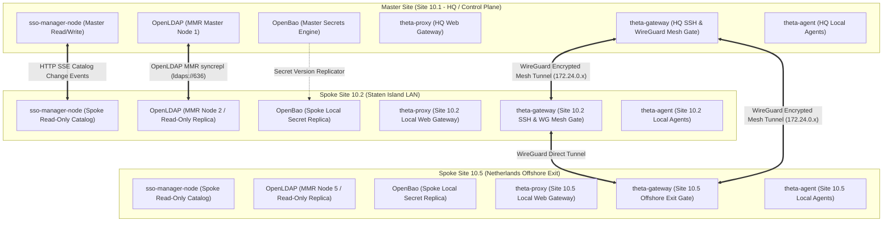

# Theta Suite Multi-Site Architecture & VPN Specification

**Specification Version**: `2.0.0`  
**Status**: Final Architecture Specification  
**Target Suite Version**: `v1.50.0+`  
**Repository**: [`theta-suite`](https://github.com/theta42/theta-suite)

---

## Executive Summary

This specification defines the multi-site replication, fault tolerance, autonomous site isolation, and integrated WireGuard mesh network architecture for the `theta-suite` ecosystem.

The architecture enforces **Deployment Symmetry**, **Explicit Master Control via `god_admin` Authority**, **`theta-gateway` Mesh & SSH Integration**, and **Zero-WAN Dependency for Local Operations**.

---

## 1. High-Level System Architecture



---

## 2. Component Core Roles

### 2.1 `theta-gateway` (Merged SSH Jump & WireGuard Mesh Gateway)
The container previously named `jump-host` is officially rebranded and expanded to **`theta-gateway`**. It acts as the single security & routing gateway for each site:
1. **SSH Jump Host (Port 2222)**: Handles interactive terminal jumps, user identity verification via local OpenLDAP, and dynamic SSH key injection.
2. **Site-Aware SSH Target Filtering**: `theta-gateway` filters target host/service selection menus strictly to resources assigned to that local site (`SITE_SLUG`).
3. **WireGuard Mesh Router (Port 51820 / 51871)**: Handles tunnel termination (`wg0`), peer key management, keepalives, and inter-site routing.
4. **NETMAP & Policy Routing Engine**: Applies `iptables` NETMAP shadow subnet translations, dynamic return path masquerading, and policy exit routes (`table offshore`, `table us_vps`).

### 2.2 `sso-manager-node` (Control Plane & Local Issuer)
* **Master Role (`isMaster = true`)**: Holds single write authority for directory resources in `inventory.sqlite`. Processes write requests proxied from Spokes.
* **Spoke Role (`isMaster = false`)**: Runs in Read-Only Catalog mode. Performs local OIDC JWT token issuance for local web apps via local OpenLDAP authentication.

### 2.3 `theta-proxy` (Site-Local Web Gateway)
* **Local Route Scope**: Manages local web application reverse proxying and TLS certificates (ACME / Let's Encrypt / local certs) 100% locally.
* **Zero Locking**: Proxy route definitions and TLS certs are not locked during Master WAN outages.

### 2.4 `theta-agent` (Site-Local Agent Hub)
* **Local WS Connection**: Connects to the local site's `sso-manager-node` WebSocket (`wss://sso.site-b.example.com/api/agent/ws`).
* **Local Autonomy**: Real-time telemetry, memory/CPU metrics, disk usage, active logged-in users (`who`), and desktop control commands (lock, display off, logout, reboot) operate 100% locally.

---

## 3. Explicit Master Control & Human `god_admin` Authority

To guarantee **0% split-brain risk**, automatic failover across WAN is explicitly disabled:

```
                          WAN OUTAGE DETECTED
                                   │
                                   ▼
             Spoke Node Unconditionally Retains SPOKE Mode
             (Read-Only Catalog / Full Local Operations)
                                   │
                                   ▼
             Requires Human god_admin Promotion Action
             (Explicit Confirmation Modal in SSO UI / CLI)
```

1. **Unreachable Master Behavior**: If a Spoke node loses WAN connection to the Master, it **unconditionally remains in Spoke Mode**.
2. **Human Re-assignment**: Changing or promoting a Master node requires an explicit action by an authenticated **`god_admin`** user via the SSO UI or `theta-suite-admin promote-master` CLI.

---

## 4. Integrated WireGuard Mesh & Key Provisioning Protocol

### 4.1 Automatic Key Exchange & Peer Discovery
1. When a new `theta-gateway` boots or joins a site via Join Key:
   - It generates a Curve25519 keypair and registers its public key, listen port, and public endpoint with `sso-manager-node` (`POST /api/mesh/gateway/register`).
2. `sso-manager-node` calculates the site index (`Site 10.x`), assigns mesh IPs (`172.24.0.x`), and broadcasts updated peer definitions to all active `theta-gateway` instances.
3. Each `theta-gateway` updates its running WireGuard interface (`wg0`) dynamically via `wgctrl` / `iptables` without dropping existing connections.

### 4.2 NETMAP Shadow Subnet Addressing (`10.<site_id>.168.0/24`)
To prevent IP collisions when multiple sites use default `192.168.1.0/24` physical LANs, `theta-gateway` automatically enables **NETMAP Shadow Subnets by default**:

```bash
# NETMAP: Shadow network (10.<site_id>.168.x) to physical LAN (192.168.1.x)
PostUp = iptables -t nat -A PREROUTING -i wg0 -d 10.<site_id>.168.0/24 -j NETMAP --to 192.168.1.0/24
PostUp = iptables -t nat -A POSTROUTING -o wg0 -s 192.168.1.0/24 -j NETMAP --to 10.<site_id>.168.0/24
PostUp = ip route add local 10.<site_id>.168.0/24 dev lo
```

* **Effect**: A server at Site 10.2 (`192.168.1.50`) can reach a server at Site 10.4 (`192.168.1.50`) by pinging `10.4.168.50`. Neither site needs to modify router DHCP or local subnets!

### 4.3 Policy Exit Routing & Return Path SOURCENAT
* **Custom Route Tables**: `theta-gateway` supports selective outbound exit tables (`table offshore`, `table us_vps`) based on IP ranges (`ip rule add from 10.x.254.0/24 lookup offshore`).
* **Dynamic Return Path SOURCENAT**: Exit nodes (e.g. Netherlands `10.5`) apply source-NAT masquerading for incoming tunnel traffic to guarantee symmetric return path routing:
  ```bash
  PostUp = iptables -t nat -A POSTROUTING -o wg0 ! -s 172.24.0.0/13 -j MASQUERADE
  ```

---

## 5. Roaming Admin Access (QR Codes & Optional Tailscale)

1. **Native WireGuard Client Profiles**:
   - `sso-manager-node` includes a built-in **Client Profile Generator** in the UI.
   - Admins can generate a mobile/laptop profile, displaying a **QR code** for immediate scan into the official WireGuard app on iOS/Android or a downloadable `wg0.conf` for laptops.
2. **Optional Tailscale / Headscale Connector**:
   - For roaming devices in environments where WireGuard UDP ports are blocked, `theta-gateway` supports an optional `tailscale` / `headscale` sidecar integration.

---

## 6. Non-Canonical Audit Logging

* **Local Activity Storage**: OAuth logins, SSH session events, proxy access logs, and agent execution events write to local site audit tables without blocking local operations.
* **Asynchronous Log Worker**: A background worker flushes log batches to Master via `POST /api/directory-admin/audit/ingest` when WAN is online.

---

## Appendix A: Production Reference WireGuard Topology Config

### Site 10.2 (Staten Island LAN Node) Gateway Reference (`wg0.conf`)
```ini
[Interface]
Address = 172.24.0.2/32
PrivateKey = <SITE_10_2_PRIVATE_KEY>
ListenPort = 51820
Table = off

# Mesh Subnet Routes
PostUp = ip route add 10.0.0.0/8 dev %i
PostUp = ip route add 172.24.0.0/13 dev %i

# Policy Routing Exits
PostUp = ip route add default via 10.5.0.1 dev %i table offshore
PostUp = ip route add default via 172.24.0.1 dev %i table us_vps
PostUp = ip rule add from 10.2.254.0/24 lookup offshore
PostUp = ip rule add from 10.2.253.0/24 lookup main preference 1000

# NETMAP Shadow Network (10.2.168.x -> 192.168.1.x)
PostUp = iptables -t nat -A PREROUTING -i %i -d 10.2.168.0/24 -j NETMAP --to 192.168.1.0/24
PostUp = iptables -t nat -A POSTROUTING -o %i -s 192.168.1.0/24 -j NETMAP --to 10.2.168.0/24
PostUp = ip route add local 10.2.168.0/24 dev lo

# Forwarding & NAT
PostUp = iptables -t nat -A POSTROUTING -s 192.168.1.0/24 -o %i -j MASQUERADE
PostUp = iptables -t nat -A POSTROUTING -o eth0 -j MASQUERADE
PostUp = iptables -A FORWARD -i %i -o eth0 -j ACCEPT
PostUp = iptables -A FORWARD -i eth0 -o %i -m state --state RELATED,ESTABLISHED -j ACCEPT

# System Kernel Options
PostUp = sysctl -w net.ipv4.ip_forward=1
PostUp = sysctl -w net.ipv4.conf.all.rp_filter=0
PostUp = sysctl -w net.ipv4.conf.eth0.rp_filter=0
PostUp = sysctl -w net.ipv4.conf.%i.rp_filter=0

# --- PEERS ---
[Peer]
# Site 10.1: US Hub / VPS Exit
PublicKey = QZCvR3N1CdUabC2xWfc1lmYKHfSiXYs1UoVINIMftws=
Endpoint = gg-si1.wgnode.com:51820
AllowedIPs = 172.24.0.0/16, 10.0.0.0/8, 0.0.0.0/0
PersistentKeepalive = 25

[Peer]
# Site 10.5: Netherlands Offshore Exit Node
PublicKey = MlF6h3YI1MIvOlgyNozCMoa/rICoLNtc7r/pseKiHQQ=
Endpoint = nl-alexhost.wgnode.com:51871
AllowedIPs = 172.24.0.5/32, 10.5.0.0/16, 0.0.0.0/0
PersistentKeepalive = 25
```

### Site 10.5 (Netherlands Exit Node) Gateway Reference (`wg0.conf`)
```ini
[Interface]
Address = 172.24.0.5/32
PrivateKey = <SITE_10_5_PRIVATE_KEY>
ListenPort = 51871

PostUp = ip addr add 10.5.0.1/16 dev %i
PostUp = iptables -t nat -A POSTROUTING -o eth0 -j MASQUERADE
# Dynamic Return Path Masquerading (SOURCENAT)
PostUp = iptables -t nat -A POSTROUTING -o %i ! -s 172.24.0.0/13 -j MASQUERADE
PostUp = sysctl -w net.ipv4.ip_forward=1

[Peer]
# Site 10.2: Staten Island LAN
PublicKey = AsS7aikCUrXpdfSvwFnMs0yUaoQ7ZCkoUVOmNdl7NS8=
AllowedIPs = 172.24.0.2/32, 10.2.0.0/16

[Peer]
# Site 10.1: US Hub VPS
PublicKey = QZCvR3N1CdUabC2xWfc1lmYKHfSiXYs1UoVINIMftws=
AllowedIPs = 172.24.0.1/32, 10.1.0.0/8
```

---

*Final Architecture Specification committed under [`docs/MULTI_SITE_SPEC.md`](file:///home/william/dev/theta42/theta-env/docs/MULTI_SITE_SPEC.md).*
