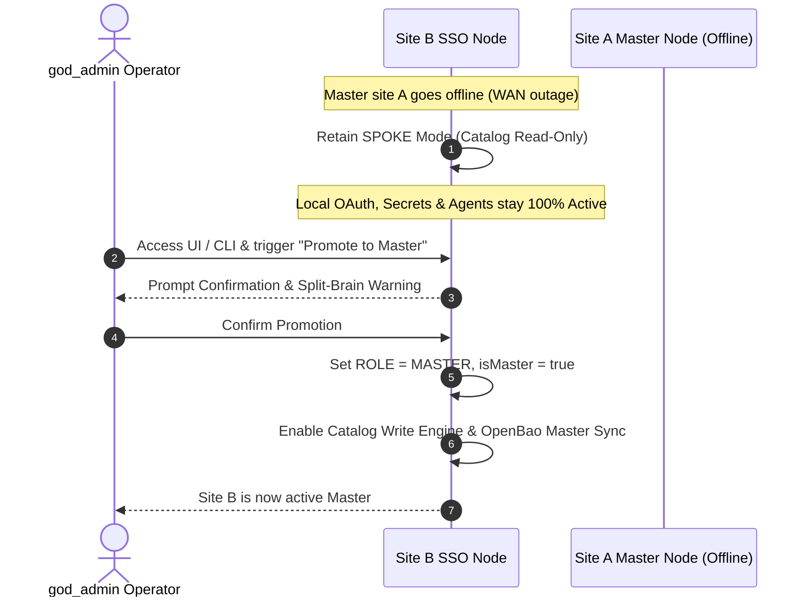

# Theta Suite Multi-Site Architecture & Replication Specification

**Specification Version**: `1.0.0`  
**Status**: Draft Architecture Proposal  
**Target Suite Version**: `v1.50.0+`  
**Repository**: [`theta-suite`](https://github.com/theta42/theta-suite)

---

## Executive Summary

This specification defines the multi-site replication, fault tolerance, and site isolation architecture for the `theta-suite` ecosystem (`sso-manager-node`, `openbao`, `openldap`, `theta-proxy`, `jump-host`, and `theta-agent`).

The architecture follows a **Symmetric Deployment with Explicit Master Control and Autonomous Site Nodes**. Every site runs an identical software stack. At any given time, one site is designated as the **Master (Control Plane)**, while all other sites operate as **Autonomous Spoke Nodes**.

If a WAN partition or outage disconnects a Spoke site from the Master, **no automatic failover is attempted** (preventing split-brain data corruption). Instead, the Spoke node remains in **Spoke Mode**—allowing local user OAuth logins, local SSH jumps, local web application proxying, local secret lookups, and local agent telemetry/controls to continue operating **100% autonomously without WAN dependency**.

---

## 1. High-Level Architecture Diagram

```mermaid
flowchart TB
    subgraph MasterSite["Master Site (HQ / Control Plane)"]
        ssoM["sso-manager-node (Master Read/Write)"]
        ldapM["OpenLDAP (MMR Master Node 1)"]
        baoM["OpenBao (Master Secrets)"]
        proxyM["theta-proxy (HQ Web Gateway)"]
        jumpM["jump-host (HQ SSH Gateway)"]
        agentM["theta-agent (HQ Local Agents)"]
    end

    subgraph SpokeSiteB["Spoke Site B (Chicago)"]
        ssoB["sso-manager-node (Spoke Read-Only Catalog)"]
        ldapB["OpenLDAP (MMR Node 2 / Read-Only Replica)"]
        baoB["OpenBao (Spoke Local Secret Replica)"]
        proxyB["theta-proxy (Site B Local Web Gateway)"]
        jumpB["jump-host (Site B SSH Gateway - Filtered)"]
        agentB["theta-agent (Site B Local Agents)"]
    end

    subgraph SpokeSiteC["Spoke Site C (Austin)"]
        ssoC["sso-manager-node (Spoke Read-Only Catalog)"]
        ldapC["OpenLDAP (MMR Node 3 / Read-Only Replica)"]
        baoC["OpenBao (Spoke Local Secret Replica)"]
        proxyC["theta-proxy (Site C Local Web Gateway)"]
        jumpC["jump-host (Site C SSH Gateway - Filtered)"]
        agentC["theta-agent (Site C Local Agents)"]
    end

    ssoM <==>|"1. SSE/HTTP Catalog Sync"| ssoB
    ssoM <==>|"1. SSE/HTTP Catalog Sync"| ssoC
    ldapM <==>|"2. OpenLDAP MMR syncrepl"| ldapB
    ldapM <==>|"2. OpenLDAP MMR syncrepl"| ldapC
    baoM -.->|"3. Secret Version Replicator"| baoB
    baoM -.->|"3. Secret Version Replicator"| baoC
```



---

## 2. Core Architectural Guarantees

| Design Aspect | Architectural Choice | System Rationale |
| :--- | :--- | :--- |
| **Deployment Symmetry** | Identical Stack everywhere | Every site runs the same Docker Compose stack & code base. |
| **Catalog Authority** | Explicit Master Designation | Single write target for `inventory.sqlite` catalog mutations. |
| **Failover Control** | **Human `god_admin` Action Only** | Zero automatic failover; eliminates split-brain risks over WAN. |
| **Isolated Autonomy** | 100% Operational Locally | OAuth logins, secrets reads, SSH jumps, and agents work offline. |
| **Write Usability** | Transparent API Proxying | Operators can issue catalog writes from any connected SSO UI. |
| **Audit Trails** | Non-Canonical Async Log Shipping | Local site logs don't block operations; flushes to Master when online. |

---

## 3. Subsystem Implementation & Data Flow

### 3.1 Directory Catalog (`inventory.sqlite`)
* **Master Site**: Holds primary write authority over directory resources (sites, hosts, services, edges, access groups).
* **Spoke Sites**: Maintain a read-only SQLite catalog replica (`inventory.sqlite`).
* **Realtime Replication**: When a resource is modified on Master, Master broadcasts an SSE / WebSocket event (`POST /api/directory-admin/sync/catalog-event`). Spoke nodes apply the update locally in real time.
* **Transparent Write Proxying**: When an operator accesses `https://sso.site-b.example.com` and performs an edit:
  - If Site B is **connected to Master**: Site B proxies `POST /api/directory-admin/*` to Master. Master applies the edit and broadcasts the change.
  - If Site B is **isolated from Master**: The UI displays a warning banner:
    > *"Master site offline. Directory catalog edits are temporarily paused until WAN connection to Master is restored."*

### 3.2 User Identity & Credentials (`OpenLDAP`)
* **Replication**: OpenLDAP `slapd` daemons across all sites run in **N-Way Multi-Master Replication (MMR)** or Provider/Consumer `syncrepl` mode over LDAPS (`ldaps://sso-master:636`).
* **Sub-Millisecond Auth**: Linux PAM/SSSD, sudo rules, and user SSH public keys hit `ldaps://localhost:636` at each site.
* **WAN Outage Impact**: **Zero.** Local servers authenticate users against local OpenLDAP replicas with zero latency.

### 3.3 OAuth 2.0 / OIDC Authentication
* **Local Issuer Endpoint**: Every site runs a local OIDC issuer (`https://sso.site-b.example.com`).
* **Isolated Login Flow**:
  1. User accesses `https://app.site-b.example.com`.
  2. Spoke Proxy redirects to `https://sso.site-b.example.com/oauth/authorize`.
  3. Spoke SSO authenticates the user against the local OpenLDAP replica.
  4. Spoke SSO issues an OIDC JWT signed by the replicated site private key.
  5. Spoke Proxy verifies the JWT against Spoke SSO JWKS (`/.well-known/jwks.json`) and grants access.
* **WAN Outage Impact**: **Zero.** Full login and access token issuance continue working during WAN isolation.

### 3.4 Reverse Proxy (`theta-proxy`)
* **Site-Local Scope**: Each site's `theta-proxy` manages its own domain routes, upstream backends, and TLS certificates (`secret/proxy/conf` in local OpenBao, ACME / Let's Encrypt certificates).
* **No Replication Required**: Proxy routes and TLS certs are independent per site. They are not stored in global SSO catalog tables and are **never locked during master outages**.

### 3.5 SSH Jump Host (`jump-host`)
* **Site-Filtered Target Menus**: Each `jump-host` container is passed its local site identity (`SITE_SLUG=site-b-chicago`).
* **Target Filter Query**:
  ```sql
  SELECT * FROM resources 
  WHERE (kind = 'host' OR kind = 'service') 
    AND (site_slug = 'site-b-chicago' OR parent_site_id = 'site-b-id');
  ```
* **Isolation Resilience**: When a user SSHs to `jump.site-b.example.com:2222`, Jump Host reads the local catalog copy and local OpenLDAP replica. Users reach Site B target servers with zero WAN dependency.

### 3.6 Theta Agent WebSocket Hubs (`theta-agent`)
* **Site-Local WS Hub**: Machines at Site B connect their `theta-agent` daemon to **Site B's local SSO node** (`wss://sso.site-b.example.com/api/agent/ws`).
* **Local Telemetry & Desktop Controls**: Real-time memory, CPU, disk partitions, logged-in users, and desktop controls (lock session, display off, logout, reboot) operate 100% locally at Site B.
* **HQ Aggregation**: When WAN is connected, Spoke SSO nodes stream telemetry summaries to Master SSO for global dashboard viewing.

### 3.7 Non-Canonical Audit & Activity Logging
* **Local Site Storage**: OAuth logins, SSH session events, proxy access logs, and agent execution events are written to local site log buffers (`inventory.sqlite` audit table or local log files).
* **Asynchronous Shipping**: A background log worker flushes log batches to Master via `POST /api/directory-admin/audit/ingest` when WAN is connected.
* **Zero Catalog Side Effects**: Audit log events never mutate resource definitions or block catalog transactions.

---

## 4. Human `god_admin` Master Re-assignment Flow

Automatic failover across WAN is explicitly disabled to prevent split-brain. Master promotion requires a human **`god_admin`** user:



---

## 5. Site Configuration Schema (`/config/sso-secrets.js`)

```javascript
module.exports = {
  stack: {
    siteName: 'site-b-chicago',
    siteSlug: 'site-b-chicago',
    role: 'spoke', // 'master' or 'spoke'
    masterUrl: 'https://sso.site-a.example.com',
    localUrl: 'https://sso.site-b.example.com',
    ldapsHost: 'sso-manager',
  },
  replication: {
    syncIntervalMs: 5000,
    catalogSyncPath: '/api/directory-admin/sync/catalog',
    auditIngestPath: '/api/directory-admin/audit/ingest',
  }
};
```

---

## 6. Implementation Phasing Plan

1. **Phase 1 (v1.50.0)**: Add `site.role` configuration, catalog read-only enforcement on Spokes, transparent write proxying, and `SITE_SLUG` filtering for `jump-host`.
2. **Phase 2 (v1.51.0)**: Implement local OIDC JWT issuance on Spokes with JWKS cross-site validation and background secret version mirror worker.
3. **Phase 3 (v1.52.0)**: Add Spoke-to-Master non-canonical audit log shipping worker and UI `god_admin` Master promotion workflow.

---

*Document generated and committed to codebase under [`docs/MULTI_SITE_SPEC.md`](file:///home/william/dev/theta42/theta-env/docs/MULTI_SITE_SPEC.md).*
