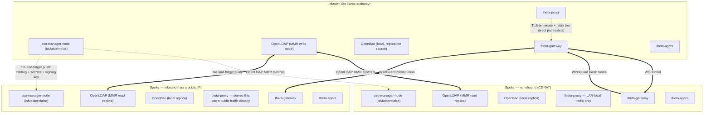

# Theta Suite Multi-Site Architecture & VPN Specification

**Specification Version**: `2.3.0`
**Status**: Mostly shipped. Read the status table at the bottom before trusting any section's detail as current behavior — this document accumulated across several build passes and earlier sections describe things that were aspirational when written and real by the time later sections were added.
**Target Suite Version**: `v2.9.0+`
**Repository**: [`theta-suite`](https://github.com/theta42/theta-suite)

> ## Shipped today
> - **Join, live replication, promotion** (`sso-manager-node`): a spoke joins via a one-time export over a site join key (`POST /api/site/join-keys` / `/export` / `/join`), then registers its own endpoint so the master can push live resync pings on every catalog write — no longer a one-time snapshot. Promotion (`POST /api/directory-admin/site-promote`) coordinates a real handoff, demoting the old master as one action. Identical agent-signing keys ride the same export/resync path. Read [`sso-manager-node/docs/site-join.md`](https://github.com/theta42/theta-directory/blob/master/docs/site-join.md) and `directory_spec.md` §11 for the endpoint-level detail.
> - **Gateway-to-gateway WireGuard mesh (v2 — "the site network", v3.0.0)**: the gateway moved out of the container stack onto the host (`jump-host/install.sh` + a systemd unit) because it is a router — NETMAP of the physical LAN, MASQUERADE out the real uplink and host-namespace net.* sysctls cannot be done from inside a Docker network namespace. The mesh is now **roster-driven**: the Directory allocates each site its one cluster-unique number (siteId, which IS the site's LDAP ServerID) and holds what every gateway published about itself (`PUT /api/mesh/self`); each gateway pulls the roster (`/api/mesh/roster`, `/peers`, `/site-clients`), converges its own `wg`/`ip`/`iptables` on it, and re-publishes. Join-the-directory *is* join-the-mesh — there is no separate mesh join flow or second allocator. Per-device internet exits each get their own interface and keypair. Verified with a three-gateway end-to-end over real WireGuard.
> - **Cross-component routing + no-inbound relay automation**: a no-inbound spoke's join (`POST /api/site/join` → `/api/site/spokes`) carries `noInbound`/`meshIp`/`publicHost`, which drives `utils/proxy_client.js` to auto-create the relay route on the master's `theta-proxy` via its existing self-service API token system (reused, not a new credential type), and replication prefers the mesh IP over the open internet when a spoke has one on file (`utils/site_replicate.js`). The one piece that stays a manual, out-of-band step is the mesh peering itself — `theta-suite`'s `bootstrap/site-relay-register.js` (`CFG_SPOKE_NO_INBOUND`/`CFG_SPOKE_PUBLIC_HOST`) picks up from there on the next `setup.sh` run.
> - **mDNS local-discovery (Linux + Windows)**: shipped and verified — `theta-gateway` announces (`services/mdns_announce.js`), `theta-agent` discovers and applies a hosts-file override, cleanly reverts when the announcement disappears. Linux was verified end-to-end over real multicast; Windows shipped in `theta-agent` v2.2.0 (CRLF-aware hosts override, `ipconfig /flushdns`, and a /32 host-route pin so the WireGuard tunnel can't swallow the direct LAN path). macOS is neither built nor currently released — `theta-agent` dropped darwin from its release matrix (`9bf728d`).
>
> **Read the status table before trusting the three bullets above.** The pattern has now repeated twice. Several things this document described as shipped since early 2026 had in fact never worked end to end — the join's LDAP import, catalog updates/deletions reaching a spoke, promotion with more than two sites, and the mesh carrying any service traffic at all. Each failure surfaced only in a note string or a swallowed exception that no test asserted on. They were fixed and covered by real multi-container tests as of 2026-08-11. It happened again with the hub-and-spoke write proxy (v3.20.0, 2026-08-17): a single wrong assumption about `req.path` under an Express mount disabled live replication, corrupted the WireGuard roster, and broke SSSD auth at every spoke — for two days, across five patch releases — because its unit tests fed it a request shape Express never produces, and the multi-site e2e is not in CI (`pr-tests.yml` runs jest only). Fixed 2026-08-18.

> The lesson worth keeping is unchanged and now twice-earned: "verified" in this file has historically meant "the happy path returned 200", not "the effect was observed". A test that constructs its own inputs proves nothing about the shape the framework actually delivers. **Put the multi-site e2e in CI.**

Design scale: a handful of sites (dozen max, 254 hard ceiling — see §4), a few hundred users/hosts total. This is a deliberate, small, trusted-operator deployment, not a hyperscale/adversarial-tenant one — several decisions below (fire-and-forget replication, identical directories) trade blast-radius for simplicity *because* the scale allows it. Don't generalize these choices past that scale without re-deriving them.

---

## 1. High-Level System Architecture



---

## 2. Every Directory Is Identical

Master and every spoke run the **same LDAP data, the same OpenBao secrets, and the same agent-signing key**. Hitting any site's `sso-manager-node` for read/auth purposes is equivalent to hitting any other. The only asymmetry is **write authority** (§3).

This is a deliberate tradeoff, not a default: it means compromising *any single spoke* — including the smallest, least-secured one — grants an attacker the same agent-command authority (`update_binary`, `arbitrary_bash`, service control) as compromising the master, because every site holds the same Ed25519 signing key (`sso-manager-node/nodejs/utils/agent_keys.js`). Accepted here because the deployment scale is small and trusted. Do not extend this pattern to a larger/adversarial-tenant deployment without revisiting it.

Consequence: `theta-agent` needs **no change** to support multi-site — it already does TOFU pairing against a single trusted key (`websocket.go:341-351`), and since that key is identical everywhere, any site's `sso-manager-node` can validly sign a command for any agent, anywhere, without agents needing a keyring.

### 2.1 What Replicates, and How

| Data | Mechanism | Direction |
|---|---|---|
| LDAP (users, groups) | OpenLDAP MMR syncrepl | master (write) → spokes (read-only edge cache) |
| OpenBao shared secrets (agent-signing key, `secret/integrations/*`, `secret/plugins/*`) | Export / adoption via `@simpleworkjs/bao-conf` | master (write) → spokes (read-only edge cache) |
| Directory catalog (Resources: hosts, apps, sites) | Existing catalog change events + live resync push | master (write) → spokes (read-only edge cache) |
| Mutating API writes (User/host creation, edits) | **Transparent Write-Forwarding**: Spoke reverse-proxies mutating requests to master | spokes (forward) → master (authoritative commit) |
| Audit log | Async batch worker, already speced (§6) | spokes → master |

### 2.2 Replication Delivery: Fire-and-Forget

Master is the sole writer (§3), so there is exactly one producer per data type — no conflict resolution, no consensus, no vector clocks needed. On every write, master pushes the change to all connected spokes **concurrently** (not sequentially — spokes are independent WG peers, none blocks on another) and does **not** wait for acks. A spoke that's offline queues nothing on the master's side; on reconnect, the spoke pulls (or master replays) missed versions.

This is a deliberate choice over "wait for all spokes to ack": with a dozen spokes, concurrent push completes in low hundreds of milliseconds on the happy path, but *waiting* for acks makes every write's latency bounded by the slowest/offline spoke — reintroducing the split-brain-adjacent stall that §3's explicit-promotion design exists to avoid. Never make a master write block on spoke reachability.

---

## 3. Explicit Master Control & Human `god_admin` Authority

Automatic failover across WAN is explicitly disabled — 0% split-brain risk by design:

```
                          WAN OUTAGE DETECTED
                                   │
                                   ▼
             Spoke Node Unconditionally Retains SPOKE Mode
                                   │
                                   ▼
             Requires Human god_admin Promotion Action
```

1. **Unreachable master**: a spoke that loses the master unconditionally stays a spoke. No auto-election.
2. **Promotion is a single coordinated action, not two steps**: `POST /api/directory-admin/site-promote` (god_admin-gated) calls out to the *current* master over the WG tunnel and demotes it as part of the same operation — there's never a window with two masters. (Requires the old master to be reachable; if it isn't, that's an operator-visible failure to resolve manually, not a silent partial-promotion.)
3. Because every directory is identical (§2), promotion carries **no agent re-keying cost** — this was the main risk in earlier drafts of this design and is now moot.
4. Site state (name, slug, `isMaster`, `masterUrl`, `wanConnected`) lives on the site's own `kind:'site'` Resource (`metadata.multiSite`), not in server memory — it must survive restarts and be visible via the same directory API as everything else.

---

## 4. `spoke.env` vs `master.env`

Exactly one of `master.env` / `spoke.env` exists per deployment — `setup.sh` refuses to run with both or neither. A fresh/standalone site uses `master.env`; a site joining an existing directory uses `spoke.env` instead, on its own, with no `master.env` alongside it.

`spoke.env` is not `master.env` plus a few extra keys layered on top — it's a complete, self-sufficient bring-up config for a spoke, with its own `spoke.env.example`. Concretely, that means:

* **No `CFG_DOMAIN`.** `CFG_DOMAIN` is the identity namespace (LDAP base DN) and must be byte-for-byte identical across every site — MMR replicas cannot diverge on it. Requiring an operator to separately learn and correctly re-type the master's own domain into a second file was a real footgun: get it wrong and the failure didn't surface until after a full local bootstrap (containers built, secrets generated), deep inside the LDIF import. Instead, `setup.sh` fetches it automatically — `POST /api/site/join` `→` **`POST /api/site/ping`**, authenticated with only the join key below, returns `baseDn`, which `setup.sh` derives `CFG_DOMAIN` from before doing anything else. A bad or revoked join key now fails in the first second, not at the end.
* **The join credential is required, not optional**: `CFG_MASTER_DIRECTORY_URL` + `CFG_MASTER_DIRECTORY_JOIN_KEY` (mint a key on the master: Directory → the Master Site modal → Site Join Keys → Mint key).
* **Everything else `master.env` has (site name, public domain/hostnames, HTTP proxy, theta-agent integration toggles, MMR manual override, ...) also has a `spoke.env` equivalent**, documented in `spoke.env.example` directly rather than by reference to `master.env.example` — the two are meant to be read independently, not cross-referenced.
* A spoke still generates its *own* local LDAP admin/JWT/service-account/bootstrap-admin secrets on first run, same as a master — it needs them to log in locally and call its own `/api/site/join`, and that local admin account remains a standing escape hatch afterward, distinct from whatever admins exist in the master's adopted LDAP tree. Only `CFG_DOMAIN` is special-cased for auto-fetch; the rest of first-run secret generation is unchanged.

`CFG_PUBLIC_DOMAIN` is a *web-hostname* concern, unrelated to LDAP, and only exists at all for inbound spokes (or a standalone site that wants a domain independent of `CFG_DOMAIN`).

### 4.1 WireGuard Mesh (v2 — "the site network", theta-gateway v3.0.0)

There is no separate mesh-join flow any more. A gateway does not negotiate its own peering — it belongs to a site, that site joined a directory, and the directory is the registry and propagation bus:

1. The Directory allocates each site its one cluster-unique **site index** (an octet; it IS the site's OpenLDAP ServerID, assigned at join). Mesh addressing gives each site `10.<site>.0.0/16` and a `172.24.0.<site>` gateway address; the **ceiling is 254** (0 and 255 excluded), far below LDAP's own 4094 — a real hard limit of the addressing, not an arbitrary cap. Real deployments target a dozen or fewer.
2. Each `theta-gateway` (installed on the host by `jump-host/install.sh`, run as a systemd service) publishes its own facts — WireGuard public key, dial endpoint, exit key, LAN/DNS mapping — via `PUT /api/mesh/self` on the directory, and pulls the roster (`/api/mesh/roster`), its peer build-plan (`/api/mesh/peers`) and its device list (`/api/mesh/site-clients`).
3. Every reconcile pass converges the gateway's own `wg0`/`ip`/`iptables` on that roster (`utils/wg_iface.js`: in-kernel WireGuard, userspace `wireguard-go` fallback; `utils/net_router.js`: NETMAP shadow subnets, exits, sysctls) without dropping existing connections — `setPrivateKey` is used rather than a full `setconf` so a peer wipe never happens on a config change.
4. Per-device internet exits each get their **own interface and keypair** (a prefix on one interface silently steals it from other peers — see `exit_router.js`). Join-the-directory *is* join-the-mesh; there is no second allocator to disagree with the first.

The gateway must reach the stack over loopback (`ldaps://127.0.0.1:636`, `http://127.0.0.1:3001`) — it no longer runs inside the compose network where `sso-manager` resolves.

---

## 5. Inbound vs. No-Inbound Spokes

Whether a spoke has a public IP determines everything about how its traffic reaches the outside world — these are two distinct, documented operating modes, not a single universal mechanism.

### 5.1 Inbound Spoke (`CFG_SPOKE_INBOUND=true`)
Behaves like a standalone install. Own `CFG_PUBLIC_DOMAIN`, own DNS pointed at its own public IP, own ACME cert. `theta-proxy` and `theta-gateway` serve public web + SSH traffic directly — no relay involved. The only WAN-facing traffic to the master is replication (§2) and audit shipping (§6).

### 5.2 No-Inbound Spoke (`CFG_SPOKE_INBOUND=false`)
No public IP exists, so *any* external access must go through the master:

1. Master mints a public hostname for the spoke's services (e.g. `sso-{slug}.{master's public domain}`) and creates the corresponding `theta-proxy` route (already dynamic/DB-backed — `proxy/nodejs/models/host.js` — no new plumbing needed there).
2. Master **terminates TLS** for that hostname and relays to the spoke over the WG tunnel — both `theta-proxy` (any site-hosted web app) and `theta-gateway` (SSH jump) traffic relay this way, not just SSO.
3. Terminating at the master (rather than SNI passthrough) is fine here specifically because master↔spoke already rides an encrypted WG tunnel — there's no unencrypted hop being introduced.

### 5.3 Local-Direct Resolution (Skip the Relay On-LAN)

A client physically on a no-inbound spoke's LAN would otherwise hairpin out to the master and back to reach its own local site. Solved via **mDNS local-service-discovery**, not directory-side network topology:

1. The spoke's `theta-gateway`/`theta-proxy` announces itself on the local segment via mDNS (`_theta-suite._tcp.local`, TXT records: site slug, public hostnames it fronts, local IP).
2. `theta-agent`, when a config flag (`prefer_local_directory` or similar — see the agent-side spec, Appendix B) is enabled, listens for this announcement and overrides local resolution for matching hostnames to the discovered local IP.
3. No match (off-site, or flag disabled) → normal public DNS → master relay. Multicast is link-local by nature, so "on-site or not" needs no explicit detection logic — presence/absence of the announcement *is* the signal. This also solves roaming-admin access (§ formerly "5", folded in here) for free: same laptop, same flag, local-fast-path at the office and relay-path everywhere else.
4. **Hard rule**: mDNS is unauthenticated on a LAN. It may only ever change *where* the agent connects, never *whether* it trusts what answers — TLS/hostname validation against the redirected IP must stay intact, so a spoofed rogue announcement produces a TLS failure, not a silent MITM.

This piece needs Windows/Mac-specific implementation and testing that can't be done from this (Linux) environment — see Appendix B for the standalone spec handed off for that work.

---

## 6. Non-Canonical Audit Logging

Unchanged from prior draft: OAuth logins, SSH session events, proxy access, and agent execution events write to local site audit tables without blocking on WAN. An async worker flushes batches to master via `POST /api/directory-admin/audit/ingest` when reachable.

---

## Appendix A: Production Reference WireGuard Topology Config

### Site 10.2 (Staten Island LAN Node) Gateway Reference (`wg0.conf`)
```ini
[Interface]
Address = 172.24.0.2/32
PrivateKey = <SITE_10_2_PRIVATE_KEY>
ListenPort = 51820
Table = off

# Mesh Subnet Routes
PostUp = ip route add 10.0.0.0/8 dev %i
PostUp = ip route add 172.24.0.0/13 dev %i

# Policy Routing Exits
PostUp = ip route add default via 10.5.0.1 dev %i table offshore
PostUp = ip route add default via 172.24.0.1 dev %i table us_vps
PostUp = ip rule add from 10.2.254.0/24 lookup offshore
PostUp = ip rule add from 10.2.253.0/24 lookup main preference 1000

# NETMAP Shadow Network (10.2.168.x -> 192.168.1.x)
PostUp = iptables -t nat -A PREROUTING -i %i -d 10.2.168.0/24 -j NETMAP --to 192.168.1.0/24
PostUp = iptables -t nat -A POSTROUTING -o %i -s 192.168.1.0/24 -j NETMAP --to 10.2.168.0/24
PostUp = ip route add local 10.2.168.0/24 dev lo

# Forwarding & NAT
PostUp = iptables -t nat -A POSTROUTING -s 192.168.1.0/24 -o %i -j MASQUERADE
PostUp = iptables -t nat -A POSTROUTING -o eth0 -j MASQUERADE
PostUp = iptables -A FORWARD -i %i -o eth0 -j ACCEPT
PostUp = iptables -A FORWARD -i eth0 -o %i -m state --state RELATED,ESTABLISHED -j ACCEPT

# System Kernel Options
PostUp = sysctl -w net.ipv4.ip_forward=1
PostUp = sysctl -w net.ipv4.conf.all.rp_filter=0
PostUp = sysctl -w net.ipv4.conf.eth0.rp_filter=0
PostUp = sysctl -w net.ipv4.conf.%i.rp_filter=0

# --- PEERS ---
[Peer]
# Site 10.1: US Hub / VPS Exit
PublicKey = QZCvR3N1CdUabC2xWfc1lmYKHfSiXYs1UoVINIMftws=
Endpoint = gg-si1.wgnode.com:51820
AllowedIPs = 172.24.0.0/16, 10.0.0.0/8, 0.0.0.0/0
PersistentKeepalive = 25

[Peer]
# Site 10.5: Netherlands Offshore Exit Node
PublicKey = MlF6h3YI1MIvOlgyNozCMoa/rICoLNtc7r/pseKiHQQ=
Endpoint = nl-alexhost.wgnode.com:51871
AllowedIPs = 172.24.0.5/32, 10.5.0.0/16, 0.0.0.0/0
PersistentKeepalive = 25
```

### Site 10.5 (Netherlands Exit Node) Gateway Reference (`wg0.conf`)
```ini
[Interface]
Address = 172.24.0.5/32
PrivateKey = <SITE_10_5_PRIVATE_KEY>
ListenPort = 51871

PostUp = ip addr add 10.5.0.1/16 dev %i
PostUp = iptables -t nat -A POSTROUTING -o eth0 -j MASQUERADE
# Dynamic Return Path Masquerading (SOURCENAT)
PostUp = iptables -t nat -A POSTROUTING -o %i ! -s 172.24.0.0/13 -j MASQUERADE
PostUp = sysctl -w net.ipv4.ip_forward=1

[Peer]
# Site 10.2: Staten Island LAN
PublicKey = AsS7aikCUrXpdfSvwFnMs0yUaoQ7ZCkoUVOmNdl7NS8=
AllowedIPs = 172.24.0.2/32, 10.2.0.0/16

[Peer]
# Site 10.1: US Hub VPS
PublicKey = QZCvR3N1CdUabC2xWfc1lmYKHfSiXYs1UoVINIMftws=
AllowedIPs = 172.24.0.1/32, 10.1.0.0/8
```

---

## Appendix B: Agent-Side Work

See [`AGENT_LOCAL_DISCOVERY_SPEC.md`](./AGENT_LOCAL_DISCOVERY_SPEC.md) — split out because it needs Windows/Mac implementation and testing that a Linux-only dev environment cannot meaningfully do. That doc is the handoff: it specifies behavior precisely enough to implement and test independently, without needing to re-derive the reasoning in this file.

---

## Status of This Spec vs. Code (as of this revision)

| Piece | Status |
|---|---|
| Site role persisted (not in-memory) | **Shipped** — `/config/site.json` on `sso-manager-node`, survives restarts (v2.2.0) |
| Join key issuance + one-time directory adoption | **Shipped** — `/api/site/join-keys`, `/api/site/export`, `/api/site/join`, fresh-install-gated (v2.2.0–v2.3.0) |
| Spoke transparent write-forwarding | **Shipped, and rewritten 2026-08-18 after it was found not to work.** A spoke forwards the mutating requests whose state the master owns AND replicates back — LDAP identity, the Resource catalog, the agent fleet, user verification — carrying the caller's identity and this spoke's own push token. Everything else runs locally. It is an ALLOWLIST on purpose: forwarding state that does not replicate back makes it invisible at the site that wrote it (a user secret would land in the master's OpenBao while the spoke keeps reading its own). The first version forwarded everything under `/api/*` with a handful of exemptions, and **the exemptions never matched**: the middleware is mounted at `/api`, so Express hands it `/site/resync` while every rule was written `/api/site/...`. That silently forwarded the master's own resync ping back to the master (live replication to every spoke was dead), the local gateway's `PUT /api/mesh/self` (every spoke's WireGuard key overwrote the MASTER's roster row), and `POST /api/v1/ldap/bind` (SSSD auth at a spoke). Its unit tests passed the absolute path as `req.path`, a shape Express never produces. |
| OpenBao integration secrets replication | **Shipped, scope corrected 2026-08-18.** `secret/integrations/*` and `secret/plugins/*` (recursively — the old flat listing read directory markers as leaves, so plugin secrets were never actually replicated) export on join/resync and adopt via `@simpleworkjs/bao-conf`. The `sso-manager` prefix was briefly included and must never be: `secret/sso-manager/conf` is a node's OWN `sso-secrets.js` — LDAP bind password, `jwtSecret`, SMTP, bootstrap admin — and bao-conf merges it over local config at boot, so a spoke came back from a restart binding to its own slapd with the master's password. `<app>/conf` is now refused on both the export and the adopt side. Per-deployment secret replication remains TODO #1, deliberately. |
| Inbound Hub Architecture | **Enforced** — Master site serves as the full-inbound anchor (public ports / domain) and transit router for spokes behind NAT/CGNAT. |
| WAN health check | **Shipped** — `/api/site/ping`, live in the Master Site modal (v2.2.0–v2.3.0) |
| `spoke.env` / `setup.sh` join wiring | **Shipped** — `CFG_MASTER_DIRECTORY_URL` / `CFG_MASTER_DIRECTORY_JOIN_KEY`, `bootstrap/site-join.js` (theta-suite v2.2.0). `spoke.env` (`spoke.env.example`) is a self-sufficient bring-up config, mutually exclusive with `master.env` — see §4 for the `CFG_DOMAIN` auto-fetch that makes it so. |
| Continuous/live replication (vs. one-time export-on-join) | **Shipped** (`sso-manager-node`) — a spoke registers its own endpoint at join time (`POST /api/site/spokes`), and every successful master catalog write fires a fire-and-forget push (`utils/site_replicate.js`) at every registered spoke, which re-pulls a fresh export. Verified end-to-end in `docker-compose.multisite-e2e.yml`. |
| Identical-directory signing key | **Shipped** — `POST /api/site/export` includes the master's agent-signing key; a spoke adopts it via `agent_keys.adopt()` on join and every resync. OpenBao secret replication *beyond* this one key is still not built. |
| OpenLDAP N-way multi-master replication auto-config | **Shipped** — the master auto-assigns each spoke a unique `LDAP_SERVER_ID` at registration (`SiteSpoke.ldapServerId`, same pattern as jump-host's mesh index) and derives every site's LDAP URL from its already-known HTTPS endpoint; `theta-suite`'s `bootstrap/site-ldap-register.js` applies it, re-checked on every `setup.sh` run since the peer list grows as spokes join. Verified against real running containers. Known gap: the master's own config only updates when ITS `setup.sh` is re-run, not live the moment a new spoke joins (see `docs/replication.md`). |
| Coordinated master promotion (demote the old master as one action) | **Shipped** — `POST /api/site/demote` + `site-promote`'s handoff logic. Fixed two real pre-existing bugs while wiring this in: `site-promote`'s god_admin check read a `req.user.groups` field nothing ever populated (permanently 403'd for everyone), and the read-only write-gate 403'd `site-promote` itself before the handler could run. |
| WireGuard gateway-to-gateway mesh (`theta-gateway`) | **Shipped (v2, theta-gateway v3.0.0 — "the site network")** — the gateway is roster-driven and runs on the HOST (systemd, `jump-host/install.sh`): the Directory allocates each site its siteId (== LDAP ServerID) and stores what every gateway publishes (`PUT /api/mesh/self`); each gateway pulls the roster and converges its own `wg`/`ip`/`iptables`. `utils/wg_iface.go` (in-kernel WireGuard, userspace `wireguard-go` fallback) uses `setPrivateKey` so a config change never wipes peers. Verified with a real three-gateway end-to-end over actual WireGuard (`jump-host` e2e), plus a two-container data-plane test carrying HTTP across a real tunnel. |
| Cross-component routing (replication over the mesh) | **Shipped** — `utils/site_replicate.js` tries a registered spoke's `meshIp` first (falling back to its public `endpoint` on failure) when pushing resync pings; a spoke with no `meshIp` on file behaves exactly as before. |
| No-inbound-spoke relay (master proxies a spoke with no public IP) | **Shipped at the API/automation layer, wired into the real bootstrap flow.** `POST /api/site/join`/`/api/site/spokes` accept `noInbound`/`meshIp`/`publicHost` and call `utils/proxy_client.js`, which mints/reuses a `theta-proxy` self-service API token (`prx_...`, OpenBao `secret/integrations/theta-proxy`) and calls the proxy's real Host API to create or update the relay route — verified against a real running `theta-proxy` container (`GET /api/host/:item`'s actual `{item, results: {...}}` response shape, not the flat shape first assumed). `theta-suite`'s `bootstrap/site-relay-register.js` + `CFG_SPOKE_NO_INBOUND`/`CFG_SPOKE_PUBLIC_HOST` (`spoke.env.example`) drive it from the operator-facing bring-up flow, re-run automatically on every `setup.sh` invocation until the jump-host mesh IP is discoverable. What's still a manual step, deliberately: the gateway-to-gateway mesh *peering* itself (mint a join token on one jump-host, paste it into the other's UI) — same pattern as minting/pasting a site join key, not something an unattended script should do blind. A spoke with zero inbound *and* zero outbound path still can't join at all (join/export still need the spoke to reach the master's API directly). |
| mDNS local-discovery (Linux) | **Shipped** — `theta-gateway` announces (`services/mdns_announce.js`, hosts + site slug set by `setup.sh` into `THETA_LOCAL_DISCOVERY_HOSTS`/`SITE_SLUG` in `/etc/theta-gateway/gateway.env`), `theta-agent` discovers and applies a hosts-file override (`local_discovery.go`). Local discovery is **always on** in the agent since v2.4.0 (the `prefer_local_directory` opt-in flag was removed). Verified end-to-end over real multicast: announce → discover → apply → clean revert on disappearance. |
| mDNS local-discovery (Windows) | **Shipped** — `theta-agent` v2.2.0: Windows hosts override (`%SystemRoot%\System32\drivers\etc\hosts`, CRLF-aware, `ipconfig /flushdns` after each change — reachable because the agent runs as a SYSTEM service, so the elevation question resolved in our favor), plus a /32 host-route pin via the owning local interface (`route.exe add ... metric 1`) so the WireGuard mesh tunnel can't swallow the direct LAN path, and a prompt WS reconnect on apply/revert. Tests run the real Windows write path on the Windows CI leg. |
| mDNS local-discovery (macOS) | Not built, and **not currently shipped at all**: `theta-agent` dropped both darwin entries from its release matrix (commit `9bf728d`, 2026-08-10) because cross-building darwin reliably needs a macOS host. The code still compiles for darwin and `dscacheutil -flushcache` plus real-hardware testing remain outstanding (Appendix B §3). |
| Directory catalog replication actually applying | **Fixed 2026-08-11** — it had never fully worked. `importDirectory` called `Resource.update(id, data)` and `ResourceEdge.delete(id)`, neither of which exists on `@simpleworkjs/orm` (update/delete are instance methods), and both threw into a swallowing `catch`. So a spoke adopted *new* resources but silently ignored every rename/metadata edit, every edge removal, and every resource deletion from the master. The injected test stubs implemented those two as statics, which is why the unit tests passed the whole time. Now: instance methods, converging (create-then-remove) edge reconciliation, master-id→slug→local-id remapping, and provenance-stamped deletion that never touches a spoke's own locally-bootstrapped resources. |
| LDAP tree adoption on join | **Fixed 2026-08-11** — also had never worked, for three stacked reasons: `ldapAddArgs()` omitted `argv[0]`, so the caller spawned `-c` (`spawn -c ENOENT`); raw `slapcat` output carries operational attributes (`structuralObjectClass`, `entryUUID`, `memberOf`, …) that `ldapadd` refuses outright; and `ldapadd -c` exits non-zero on the benign "Already exists" every spoke produces, so even a good import reported failure. Every one of these surfaced only in a `ldap.note` string that no test asserted on. The e2e now seeds a master-only user and requires it to appear in the spoke's own slapd. |
| Base-DN mismatch between sites | **Guarded** — §4 has always required one `CFG_DOMAIN` cluster-wide, but a mismatch used to half-succeed: catalog and signing key adopted, LDAP silently rejected entry by entry. `POST /api/site/join` now refuses up front with both DNs in the message. |
| Promotion in a cluster with 3+ sites | **Fixed 2026-08-11** — promotion only ever worked for two sites. The promoted node was a spoke, so its own `SiteSpoke` registry was empty and `replicateToSpokes('master-promoted')` fanned out to nobody; every sibling spoke kept following the demoted master. `POST /api/site/demote` now hands its registry (including each spoke's `pushToken`) to the incoming master, which adopts it and re-points each sibling via `POST /api/site/master-changed`. Covered by a real three-site e2e (`docker-compose.multisite-e2e.yml`). |
| Mesh **data plane** (relay/replication actually crossing the tunnel) | **Superseded by the mesh-v2 rewrite (theta-gateway v3.0.0).** The old container-era "userspace forwarder" layer (`services/mesh_forwarder.js`, port-derived `mesh_route.js`) was one of the things v2 eliminated: the gateway now runs on the host with real routing (`net_router.js`), so a spoke's `meshIp` is a dial-able address again and replication/relay reach it directly. Verified with a real three-gateway e2e and a two-container data-plane test carrying HTTP over an actual WireGuard tunnel. |
| LDAP replication config applied automatically | **Shipped 2026-08-11 — this used to require an operator `setup.sh` re-run on every site, which is not an acceptable answer.** `slapd` now runs from the `cn=config` dynamic backend (converted at container start from the generated `slapd.conf` seed — `docker-entrypoint.sh`), so `olcServerID`/`olcSyncrepl` are modifiable while it serves. `utils/ldap_runtime_config.js` converges the running config on the cluster's current view (reads live config, computes the delta, applies only what differs), and `utils/ldap_reconcile.js` triggers it on every event that can change it: spoke registered/removed, join, resync, master-changed, promotion, boot, plus a periodic sweep. No restart, no downtime, no operator step; a node that was offline while the cluster changed converges when it returns. Drift detection (`replicationDrift`, reported for master and spokes alike on `GET /directory-admin/site-status` and badged in the Multi-Site modal) is retained as a **fault indicator** — under normal operation it never fires, and if it does the automatic path failed and the `[ldap-reconcile]` log lines say why. Proven by the three-site e2e reading the running `cn=config` back over `ldapsearch` after a second spoke joins. |
| Spoke registry operations | **Shipped** — the Registered Spokes table was read-only, so a decommissioned site's row held its LDAP ServerID and collected replication pushes forever. `DELETE /api/site/spokes/:id`, `POST /api/site/spokes/resync` (awaited, so "Sync now" reports real reachability) and a spoke-side `POST /api/site/reregister` (the recovery path when the two ends disagree about the push token, which `POST /join` cannot fix once a node is a spoke) are wired into the modal. |

| Catalog replication vs. a spoke's OWN resources | **Fixed 2026-08-18.** Two separate ways replication ate the site it was replicating to. (a) The edge-removal pass had no provenance check, so every resync deleted every local edge missing from the master's export — the spoke's own `site → host → service` tree and everything its plugins had discovered. Removal is now scoped to edges between resources the master governs. (b) Upsert-by-slug overwrote locally-owned rows: every site's bootstrap seeds the SAME fixed service slugs (`sso-manager`, `proxy`, `openldap`, `openresty`, `jump-host`), and the master auto-creates a site row under the slug the spoke's own bootstrap already used — so a spoke's `sso-manager` got the master's address and its own site row lost `isCurrentSite: true`, after which the UI called the master's site "here". Such rows are still adopted, but local metadata wins and they are never deletable (`__locallyOwned`). |
| Agent fleet replication | **Fixed 2026-08-18.** The export sent `Agent.toPublic()`, which strips `tokenHash` — so a spoke got a fleet list it could display and not one agent it could authenticate: no WebSocket, no `/api/v1/ldap` for SSSD, no node secrets, anywhere but the master. `Agent.toReplica()` carries the hash (a SHA-256, in an export that already carries the whole LDAP tree and the cluster signing key behind the same join-key gate). |
| Inter-site request authentication | **Hardened 2026-08-18.** `Bearer <SiteJoinKey>` + `X-Forwarded-User` authenticated as any named user. A join key is pasted into every spoke's `spoke.env` and printed in setup output, and previously bought only a directory export; this made it a cluster-wide impersonation credential, `god_admin` included. Only a per-spoke `SiteSpoke.pushToken` is accepted, and `X-Forwarded-Spoke` must match the row it resolves to. |
| One site, one registry row | **Fixed 2026-08-18.** The registry is keyed on the endpoint string, and three things disagreed about it: `setup.sh` joined with `http://` under `CFG_CREATE_ALL_HTTP=1` while its relay and LDAP steps hardcoded `https://`, and the UI's Re-register passed `window.location.origin`. One site therefore produced two rows, two LDAP ServerIDs and two push tokens, and `GET /api/site/ldap-peers` answered "not a registered spoke" for the one that had actually joined. `SPOKE_SELF_URL` is derived once in `setup.sh`, and a recorded endpoint always wins over a caller-supplied one (`replaceEndpoint: true` to move a site deliberately). |
| No-inbound spoke, LDAP peer reachability | **Fixed 2026-08-18.** MMR peer URLs were derived from a spoke's public HTTP endpoint — which for a CGNAT site is by definition undialable, so syncrepl on every other node retried a dead host forever and that site's tree never converged. `ldapHostForSpoke()` dials such a spoke over the mesh, the same preference resync pushes already used. |
| This node's own site id | **Fixed 2026-08-18.** `mesh_roster.localSiteId()` read the `slapd.conf` seed, which only carries whatever `LDAP_SERVER_ID` was in the container environment at boot — a value a spoke does not have until `setup.sh` is re-run AFTER joining, while `ldap_reconcile` had already converged the live `cn=config` on the assigned id. A freshly-joined spoke therefore published its gateway under the wrong site id (usually 1, the master's). The assigned id now rides back on `POST /api/site/spokes` and is persisted to `site.json`. |

### TODO — what's actually left

1. **Full secret replication** — only the agent-signing key is replicated today. LDAP admin credentials, JWT secrets, and other per-deployment secrets still differ per site, which complicates full disaster recovery. **Paused pending a real-deployment question independent of the code**: this repo's own `conf/secrets.js` was found to contain committed real credentials during this work (LDAP bind, SMTP, VoIP.ms) — see the git-remediation note elsewhere in this repo's history. Building a feature that copies live secrets to additional sites shouldn't proceed until provider-side rotation of those specific credentials is confirmed done; the mechanism itself (generic secret sync, never touching those particular values) can still be designed without that answer.
2. Service-to-service auth, cross-component routing, no-inbound relay automation, and mesh peer cleanup (the four items formerly listed here) are **done** — see the status table above. What remains genuinely open in that area is documented there inline (mesh peering stays a manual step by design; zero-inbound-and-zero-outbound spokes still can't join).

3. ~~Applying LDAP replication config without an operator.~~ **Done** — the `cn=config` migration described here as "a real migration, not a patch" was carried out (status table). Adding a site is now fully hands-off.

4. **Promotion when the old master is unreachable.** The registry handover rides on the demote call, so a promotion that cannot reach the outgoing master inherits nothing and the sibling spokes stay pointed at a node that is gone. `site-promote` reports this honestly (`siblings.orphaned`), and the recovery is per-spoke: re-point each one with `POST /api/site/master-changed`, or re-register it. Worth automating only if it happens for real.

5. **LDAP tunnel wire format** (`sso-manager-node/utils/ldap_tunnel.js`) still base64-encodes raw LDAP BER inside JSON WebSocket frames, ~33% overhead on large directory syncs. Binary frames would need a negotiated capability flag, since every deployed `theta-agent` speaks the current format — tracked as [theta-directory#211](https://github.com/theta42/theta-directory/issues/211) rather than done here, deliberately: the overhead is irrelevant for SSSD's binds and only shows up on bulk enumeration. The relay's real bug (unbounded, never-timing-out sockets) is fixed: idle and connect deadlines, a per-agent ceiling, and per-WebSocket cleanup so a reconnect no longer tears down the new connection's relays.

**mDNS local-discovery, macOS** is deliberately not listed above: the Linux and Windows sides are shipped and verified (`theta-agent` v2.2.0), and macOS is being built on a real macOS VM where the darwin-specific behavior (mDNSResponder/DNS-cache) can actually be tested. Check `theta-agent`'s recent history before assuming it's still open.

*Committed under [`docs/MULTI_SITE_SPEC.md`](file:///home/william/dev/theta42/theta-env/docs/MULTI_SITE_SPEC.md).*
