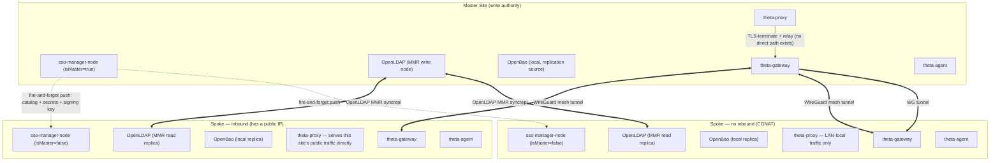

# Theta Suite Multi-Site Architecture & VPN Specification

**Specification Version**: `2.2.0`
**Status**: Mostly shipped. Read the status table at the bottom before trusting any section's detail as current behavior — this document accumulated across several build passes and earlier sections describe things that were aspirational when written and real by the time later sections were added.
**Target Suite Version**: `v1.50.0+`
**Repository**: [`theta-suite`](https://github.com/theta42/theta-suite)

> ## Shipped today
> - **Join, live replication, promotion** (`sso-manager-node`): a spoke joins via a one-time export over a site join key (`POST /api/site/join-keys` / `/export` / `/join`), then registers its own endpoint so the master can push live resync pings on every catalog write — no longer a one-time snapshot. Promotion (`POST /api/directory-admin/site-promote`) coordinates a real handoff, demoting the old master as one action. Identical agent-signing keys ride the same export/resync path. Read [`sso-manager-node/docs/site-join.md`](https://github.com/theta42/theta-directory/blob/master/docs/site-join.md) and `directory_spec.md` §11 for the endpoint-level detail.
> - **Gateway-to-gateway WireGuard mesh** (`theta-gateway`): real site-to-site tunnels via `POST /api/mesh/register`/`/join`, kernel WireGuard with a userspace `wireguard-go` fallback. Verified with an actual two-container encrypted tunnel passing traffic, not a mock.
> - **Cross-component routing + no-inbound relay automation**: `sso-manager-node`'s replication traffic now prefers a spoke's mesh IP over the open internet when one is on file (`utils/site_replicate.js`), and a no-inbound spoke's join (`POST /api/site/join` → `/api/site/spokes`) can carry `noInbound`/`meshIp`/`publicHost`, which drives `utils/proxy_client.js` to auto-create the relay route on the master's `theta-proxy` via its existing self-service API token system (reused, not a new credential type). The one piece that stays a manual, out-of-band step is the mesh peering itself (mint a join token on one jump-host, paste it into the other's "Join a mesh" UI) — `theta-suite`'s `bootstrap/site-relay-register.js` (`CFG_SPOKE_NO_INBOUND`/`CFG_SPOKE_PUBLIC_HOST`) picks up from there on the next `setup.sh` run.
> - **mDNS local-discovery (Linux + Windows)**: shipped and verified — `theta-gateway` announces (`services/mdns_announce.js`), `theta-agent` discovers and applies a hosts-file override, cleanly reverts when the announcement disappears. Linux was verified end-to-end over real multicast; Windows shipped in `theta-agent` v2.2.0 (CRLF-aware hosts override, `ipconfig /flushdns`, and a /32 host-route pin so the WireGuard tunnel can't swallow the direct LAN path). macOS still needs real testing — see the TODO note.

Design scale: a handful of sites (dozen max, 254 hard ceiling — see §4), a few hundred users/hosts total. This is a deliberate, small, trusted-operator deployment, not a hyperscale/adversarial-tenant one — several decisions below (fire-and-forget replication, identical directories) trade blast-radius for simplicity *because* the scale allows it. Don't generalize these choices past that scale without re-deriving them.

---

## 1. High-Level System Architecture



---

## 2. Every Directory Is Identical

Master and every spoke run the **same LDAP data, the same OpenBao secrets, and the same agent-signing key**. Hitting any site's `sso-manager-node` for read/auth purposes is equivalent to hitting any other. The only asymmetry is **write authority** (§3).

This is a deliberate tradeoff, not a default: it means compromising *any single spoke* — including the smallest, least-secured one — grants an attacker the same agent-command authority (`update_binary`, `arbitrary_bash`, service control) as compromising the master, because every site holds the same Ed25519 signing key (`sso-manager-node/nodejs/utils/agent_keys.js`). Accepted here because the deployment scale is small and trusted. Do not extend this pattern to a larger/adversarial-tenant deployment without revisiting it.

Consequence: `theta-agent` needs **no change** to support multi-site — it already does TOFU pairing against a single trusted key (`websocket.go:341-351`), and since that key is identical everywhere, any site's `sso-manager-node` can validly sign a command for any agent, anywhere, without agents needing a keyring.

### 2.1 What Replicates, and How

| Data | Mechanism | Direction |
|---|---|---|
| LDAP (users, groups) | OpenLDAP MMR syncrepl | master (write) → spokes (read-only) |
| OpenBao secrets (incl. agent-signing key at `secret/agent/signing-key`) | **New**: custom replicator (OpenBao has no built-in multi-site replication — Performance Replication is Vault-Enterprise-only, confirmed absent from OpenBao as of this writing) | master (write) → spokes (read-only) |
| Directory catalog (Resources: hosts, apps, sites) | Existing catalog change events | master (write) → spokes (read-only) |
| Audit log | Async batch worker, already speced (§6) | spokes → master |

### 2.2 Replication Delivery: Fire-and-Forget

Master is the sole writer (§3), so there is exactly one producer per data type — no conflict resolution, no consensus, no vector clocks needed. On every write, master pushes the change to all connected spokes **concurrently** (not sequentially — spokes are independent WG peers, none blocks on another) and does **not** wait for acks. A spoke that's offline queues nothing on the master's side; on reconnect, the spoke pulls (or master replays) missed versions.

This is a deliberate choice over "wait for all spokes to ack": with a dozen spokes, concurrent push completes in low hundreds of milliseconds on the happy path, but *waiting* for acks makes every write's latency bounded by the slowest/offline spoke — reintroducing the split-brain-adjacent stall that §3's explicit-promotion design exists to avoid. Never make a master write block on spoke reachability.

---

## 3. Explicit Master Control & Human `god_admin` Authority

Automatic failover across WAN is explicitly disabled — 0% split-brain risk by design:

```
                          WAN OUTAGE DETECTED
                                   │
                                   ▼
             Spoke Node Unconditionally Retains SPOKE Mode
                                   │
                                   ▼
             Requires Human god_admin Promotion Action
```

1. **Unreachable master**: a spoke that loses the master unconditionally stays a spoke. No auto-election.
2. **Promotion is a single coordinated action, not two steps**: `POST /api/directory-admin/site-promote` (god_admin-gated) calls out to the *current* master over the WG tunnel and demotes it as part of the same operation — there's never a window with two masters. (Requires the old master to be reachable; if it isn't, that's an operator-visible failure to resolve manually, not a silent partial-promotion.)
3. Because every directory is identical (§2), promotion carries **no agent re-keying cost** — this was the main risk in earlier drafts of this design and is now moot.
4. Site state (name, slug, `isMaster`, `masterUrl`, `wanConnected`) lives on the site's own `kind:'site'` Resource (`metadata.multiSite`), not in server memory — it must survive restarts and be visible via the same directory API as everything else.

---

## 4. `spoke.env` vs `setup.env`

A spoke shares almost none of `setup.env`'s concerns (it doesn't mint LDAP admin/JWT/service-account secrets — those arrive via replication, §2) so it gets its own, much shorter file:

```
CFG_DOMAIN=theta42.com          # REQUIRED, must match the master's exactly — this is the shared LDAP base DN (dc=theta42,dc=com). Never per-site.
CFG_SITE_NAME=staten-island     # this site's name/slug
CFG_SPOKE_INBOUND=false         # true: this site has a public IP and serves its own traffic directly (standalone-style). false: no inbound path exists; master relays (§5).
CFG_PUBLIC_DOMAIN=              # only used when CFG_SPOKE_INBOUND=true — this site's own domain, own DNS, own ACME cert, independent of the master's domain.
CFG_JOIN_TOKEN=                 # one-time token from the master, used for WG mesh auto-registration (§4.1) and initial catalog/secret pull.
CFG_MASTER_ENDPOINT=            # master's WG endpoint (host:port) to join through.
```

`CFG_DOMAIN` is the identity namespace (LDAP DN) and must be identical across every site — MMR replicas cannot diverge on base DN. `CFG_PUBLIC_DOMAIN` is a *web-hostname* concern, unrelated to LDAP, and only exists at all for inbound spokes.

### 4.1 WireGuard Mesh Auto-Registration

1. A new `theta-gateway` boots with `CFG_JOIN_TOKEN` + `CFG_MASTER_ENDPOINT`, generates its Curve25519 keypair, and calls `POST /api/mesh/gateway/register` on the master over an initial bootstrap tunnel.
2. Master assigns the next free **site index** (one octet, used identically in both `172.24.<site>.0/16` and `10.<site>.0.0/16` per the reference topology in Appendix A) and returns full mesh peer config.
3. **Site index ceiling is 254** (0 and 255 excluded) — a hard technical limit of this addressing scheme, not an arbitrary cap. Real deployments target a dozen or fewer; no need to cap lower than the real ceiling.
4. Each `theta-gateway` applies the new peer set to its running `wg0` via `wgctrl` without dropping existing connections.

---

## 5. Inbound vs. No-Inbound Spokes

Whether a spoke has a public IP determines everything about how its traffic reaches the outside world — these are two distinct, documented operating modes, not a single universal mechanism.

### 5.1 Inbound Spoke (`CFG_SPOKE_INBOUND=true`)
Behaves like a standalone install. Own `CFG_PUBLIC_DOMAIN`, own DNS pointed at its own public IP, own ACME cert. `theta-proxy` and `theta-gateway` serve public web + SSH traffic directly — no relay involved. The only WAN-facing traffic to the master is replication (§2) and audit shipping (§6).

### 5.2 No-Inbound Spoke (`CFG_SPOKE_INBOUND=false`)
No public IP exists, so *any* external access must go through the master:

1. Master mints a public hostname for the spoke's services (e.g. `sso-{slug}.{master's public domain}`) and creates the corresponding `theta-proxy` route (already dynamic/DB-backed — `proxy/nodejs/models/host.js` — no new plumbing needed there).
2. Master **terminates TLS** for that hostname and relays to the spoke over the WG tunnel — both `theta-proxy` (any site-hosted web app) and `theta-gateway` (SSH jump) traffic relay this way, not just SSO.
3. Terminating at the master (rather than SNI passthrough) is fine here specifically because master↔spoke already rides an encrypted WG tunnel — there's no unencrypted hop being introduced.

### 5.3 Local-Direct Resolution (Skip the Relay On-LAN)

A client physically on a no-inbound spoke's LAN would otherwise hairpin out to the master and back to reach its own local site. Solved via **mDNS local-service-discovery**, not directory-side network topology:

1. The spoke's `theta-gateway`/`theta-proxy` announces itself on the local segment via mDNS (`_theta-suite._tcp.local`, TXT records: site slug, public hostnames it fronts, local IP).
2. `theta-agent`, when a config flag (`preferLocalDiscoveredDirectory` or similar — see the agent-side spec, Appendix B) is enabled, listens for this announcement and overrides local resolution for matching hostnames to the discovered local IP.
3. No match (off-site, or flag disabled) → normal public DNS → master relay. Multicast is link-local by nature, so "on-site or not" needs no explicit detection logic — presence/absence of the announcement *is* the signal. This also solves roaming-admin access (§ formerly "5", folded in here) for free: same laptop, same flag, local-fast-path at the office and relay-path everywhere else.
4. **Hard rule**: mDNS is unauthenticated on a LAN. It may only ever change *where* the agent connects, never *whether* it trusts what answers — TLS/hostname validation against the redirected IP must stay intact, so a spoofed rogue announcement produces a TLS failure, not a silent MITM.

This piece needs Windows/Mac-specific implementation and testing that can't be done from this (Linux) environment — see Appendix B for the standalone spec handed off for that work.

---

## 6. Non-Canonical Audit Logging

Unchanged from prior draft: OAuth logins, SSH session events, proxy access, and agent execution events write to local site audit tables without blocking on WAN. An async worker flushes batches to master via `POST /api/directory-admin/audit/ingest` when reachable.

---

## Appendix A: Production Reference WireGuard Topology Config

### Site 10.2 (Staten Island LAN Node) Gateway Reference (`wg0.conf`)
```ini
[Interface]
Address = 172.24.0.2/32
PrivateKey = <SITE_10_2_PRIVATE_KEY>
ListenPort = 51820
Table = off

# Mesh Subnet Routes
PostUp = ip route add 10.0.0.0/8 dev %i
PostUp = ip route add 172.24.0.0/13 dev %i

# Policy Routing Exits
PostUp = ip route add default via 10.5.0.1 dev %i table offshore
PostUp = ip route add default via 172.24.0.1 dev %i table us_vps
PostUp = ip rule add from 10.2.254.0/24 lookup offshore
PostUp = ip rule add from 10.2.253.0/24 lookup main preference 1000

# NETMAP Shadow Network (10.2.168.x -> 192.168.1.x)
PostUp = iptables -t nat -A PREROUTING -i %i -d 10.2.168.0/24 -j NETMAP --to 192.168.1.0/24
PostUp = iptables -t nat -A POSTROUTING -o %i -s 192.168.1.0/24 -j NETMAP --to 10.2.168.0/24
PostUp = ip route add local 10.2.168.0/24 dev lo

# Forwarding & NAT
PostUp = iptables -t nat -A POSTROUTING -s 192.168.1.0/24 -o %i -j MASQUERADE
PostUp = iptables -t nat -A POSTROUTING -o eth0 -j MASQUERADE
PostUp = iptables -A FORWARD -i %i -o eth0 -j ACCEPT
PostUp = iptables -A FORWARD -i eth0 -o %i -m state --state RELATED,ESTABLISHED -j ACCEPT

# System Kernel Options
PostUp = sysctl -w net.ipv4.ip_forward=1
PostUp = sysctl -w net.ipv4.conf.all.rp_filter=0
PostUp = sysctl -w net.ipv4.conf.eth0.rp_filter=0
PostUp = sysctl -w net.ipv4.conf.%i.rp_filter=0

# --- PEERS ---
[Peer]
# Site 10.1: US Hub / VPS Exit
PublicKey = QZCvR3N1CdUabC2xWfc1lmYKHfSiXYs1UoVINIMftws=
Endpoint = gg-si1.wgnode.com:51820
AllowedIPs = 172.24.0.0/16, 10.0.0.0/8, 0.0.0.0/0
PersistentKeepalive = 25

[Peer]
# Site 10.5: Netherlands Offshore Exit Node
PublicKey = MlF6h3YI1MIvOlgyNozCMoa/rICoLNtc7r/pseKiHQQ=
Endpoint = nl-alexhost.wgnode.com:51871
AllowedIPs = 172.24.0.5/32, 10.5.0.0/16, 0.0.0.0/0
PersistentKeepalive = 25
```

### Site 10.5 (Netherlands Exit Node) Gateway Reference (`wg0.conf`)
```ini
[Interface]
Address = 172.24.0.5/32
PrivateKey = <SITE_10_5_PRIVATE_KEY>
ListenPort = 51871

PostUp = ip addr add 10.5.0.1/16 dev %i
PostUp = iptables -t nat -A POSTROUTING -o eth0 -j MASQUERADE
# Dynamic Return Path Masquerading (SOURCENAT)
PostUp = iptables -t nat -A POSTROUTING -o %i ! -s 172.24.0.0/13 -j MASQUERADE
PostUp = sysctl -w net.ipv4.ip_forward=1

[Peer]
# Site 10.2: Staten Island LAN
PublicKey = AsS7aikCUrXpdfSvwFnMs0yUaoQ7ZCkoUVOmNdl7NS8=
AllowedIPs = 172.24.0.2/32, 10.2.0.0/16

[Peer]
# Site 10.1: US Hub VPS
PublicKey = QZCvR3N1CdUabC2xWfc1lmYKHfSiXYs1UoVINIMftws=
AllowedIPs = 172.24.0.1/32, 10.1.0.0/8
```

---

## Appendix B: Agent-Side Work

See [`AGENT_LOCAL_DISCOVERY_SPEC.md`](./AGENT_LOCAL_DISCOVERY_SPEC.md) — split out because it needs Windows/Mac implementation and testing that a Linux-only dev environment cannot meaningfully do. That doc is the handoff: it specifies behavior precisely enough to implement and test independently, without needing to re-derive the reasoning in this file.

---

## Status of This Spec vs. Code (as of this revision)

| Piece | Status |
|---|---|
| Site role persisted (not in-memory) | **Shipped** — `/config/site.json` on `sso-manager-node`, survives restarts (v2.2.0) |
| Join key issuance + one-time directory adoption | **Shipped** — `/api/site/join-keys`, `/api/site/export`, `/api/site/join`, fresh-install-gated (v2.2.0–v2.3.0) |
| Spoke read-only enforcement | **Shipped** — directory-write routes 403 toward the master once joined (v2.3.0) |
| WAN health check | **Shipped** — `/api/site/ping`, live in the Master Site modal (v2.2.0–v2.3.0) |
| `setup.env` / `setup.sh` join wiring | **Shipped** — `CFG_MASTER_DIRECTORY_URL` / `CFG_MASTER_DIRECTORY_JOIN_KEY`, `bootstrap/site-join.js` (theta-suite v2.2.0) |
| Continuous/live replication (vs. one-time export-on-join) | **Shipped** (`sso-manager-node`) — a spoke registers its own endpoint at join time (`POST /api/site/spokes`), and every successful master catalog write fires a fire-and-forget push (`utils/site_replicate.js`) at every registered spoke, which re-pulls a fresh export. Verified end-to-end in `docker-compose.multisite-e2e.yml`. |
| Identical-directory signing key | **Shipped** — `POST /api/site/export` includes the master's agent-signing key; a spoke adopts it via `agent_keys.adopt()` on join and every resync. OpenBao secret replication *beyond* this one key is still not built. |
| Coordinated master promotion (demote the old master as one action) | **Shipped** — `POST /api/site/demote` + `site-promote`'s handoff logic. Fixed two real pre-existing bugs while wiring this in: `site-promote`'s god_admin check read a `req.user.groups` field nothing ever populated (permanently 403'd for everyone), and the read-only write-gate 403'd `site-promote` itself before the handler could run. |
| WireGuard gateway-to-gateway mesh (`theta-gateway`) | **Shipped** — `POST /api/mesh/register`/`/join` (join-token bootstrap), `utils/wg_iface.js` (kernel WireGuard, falls back to userspace `wireguard-go`). Verified with a real two-container test: actual encrypted tunnel, real ICMP traffic across it, 0% loss. `wg_iface.removePeer()` also cleans up the kernel routes `setPeer()` added (verified live: routes present after `setPeer`, gone after `removePeer`, own local route untouched), and `DELETE /api/mesh/gateways/:id` exposes it from the mesh UI. |
| Cross-component routing (replication over the mesh) | **Shipped** — `utils/site_replicate.js` tries a registered spoke's `meshIp` first (falling back to its public `endpoint` on failure) when pushing resync pings; a spoke with no `meshIp` on file behaves exactly as before. |
| No-inbound-spoke relay (master proxies a spoke with no public IP) | **Shipped at the API/automation layer, wired into the real bootstrap flow.** `POST /api/site/join`/`/api/site/spokes` accept `noInbound`/`meshIp`/`publicHost` and call `utils/proxy_client.js`, which mints/reuses a `theta-proxy` self-service API token (`prx_...`, OpenBao `secret/integrations/theta-proxy`) and calls the proxy's real Host API to create or update the relay route — verified against a real running `theta-proxy` container (`GET /api/host/:item`'s actual `{item, results: {...}}` response shape, not the flat shape first assumed). `theta-suite`'s `bootstrap/site-relay-register.js` + `CFG_SPOKE_NO_INBOUND`/`CFG_SPOKE_PUBLIC_HOST` (`setup.env.example`) drive it from the operator-facing bring-up flow, re-run automatically on every `setup.sh` invocation until the jump-host mesh IP is discoverable. What's still a manual step, deliberately: the gateway-to-gateway mesh *peering* itself (mint a join token on one jump-host, paste it into the other's UI) — same pattern as minting/pasting a site join key, not something an unattended script should do blind. A spoke with zero inbound *and* zero outbound path still can't join at all (join/export still need the spoke to reach the master's API directly). |
| mDNS local-discovery (Linux) | **Shipped** — `theta-gateway` announces (`services/mdns_announce.js`, opt-in via `THETA_LOCAL_DISCOVERY_HOSTS`), `theta-agent` discovers and applies a hosts-file override (`local_discovery.go`, opt-in via `prefer_local_directory`). Verified end-to-end with real containers over real multicast: announce → discover → apply → clean revert on disappearance, all confirmed. Caught two real bugs along the way (`mdns.Lookup()`'s IPv6 query aborting the whole lookup even after a valid IPv4 response arrived; `rename()` failing with EBUSY over a bind-mounted `/etc/hosts`, common in every container runtime) — see the commit messages in `theta-agent`. |
| mDNS local-discovery (Windows) | **Shipped** — `theta-agent` v2.2.0: Windows hosts override (`%SystemRoot%\System32\drivers\etc\hosts`, CRLF-aware, `ipconfig /flushdns` after each change — reachable because the agent runs as a SYSTEM service, so the elevation question resolved in our favor), plus a /32 host-route pin via the owning local interface (`route.exe add ... metric 1`) so the WireGuard mesh tunnel can't swallow the direct LAN path, and a prompt WS reconnect on apply/revert. Tests run the real Windows write path on the Windows CI leg. |
| mDNS local-discovery (macOS) | Not built — the hosts override compiles on darwin via the shared unix path, but macOS still needs `dscacheutil -flushcache` and real hardware testing (mDNSResponder behavior, hosts-file vs. native Bonjour — see Appendix B §3). Being built on a real macOS VM. |

### TODO — what's actually left

1. **Full secret replication** — only the agent-signing key is replicated today. LDAP admin credentials, JWT secrets, and other per-deployment secrets still differ per site, which complicates full disaster recovery. **Paused pending a real-deployment question independent of the code**: this repo's own `conf/secrets.js` was found to contain committed real credentials during this work (LDAP bind, SMTP, VoIP.ms) — see the git-remediation note elsewhere in this repo's history. Building a feature that copies live secrets to additional sites shouldn't proceed until provider-side rotation of those specific credentials is confirmed done; the mechanism itself (generic secret sync, never touching those particular values) can still be designed without that answer.
2. Service-to-service auth, cross-component routing, no-inbound relay automation, and mesh peer cleanup (the four items formerly listed here) are **done** — see the status table above. What remains genuinely open in that area is documented there inline (mesh peering stays a manual step by design; zero-inbound-and-zero-outbound spokes still can't join).

**mDNS local-discovery, macOS** is deliberately not listed above: the Linux and Windows sides are shipped and verified (`theta-agent` v2.2.0), and macOS is being built on a real macOS VM where the darwin-specific behavior (mDNSResponder/DNS-cache) can actually be tested. Check `theta-agent`'s recent history before assuming it's still open.

*Committed under [`docs/MULTI_SITE_SPEC.md`](file:///home/william/dev/theta42/theta-env/docs/MULTI_SITE_SPEC.md).*
