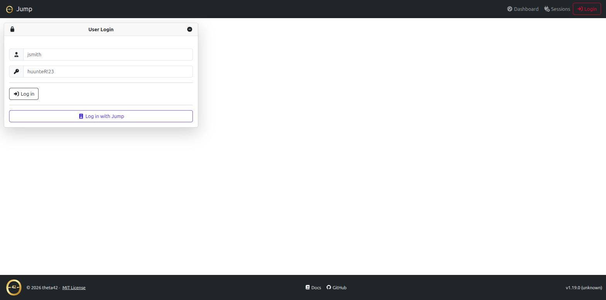
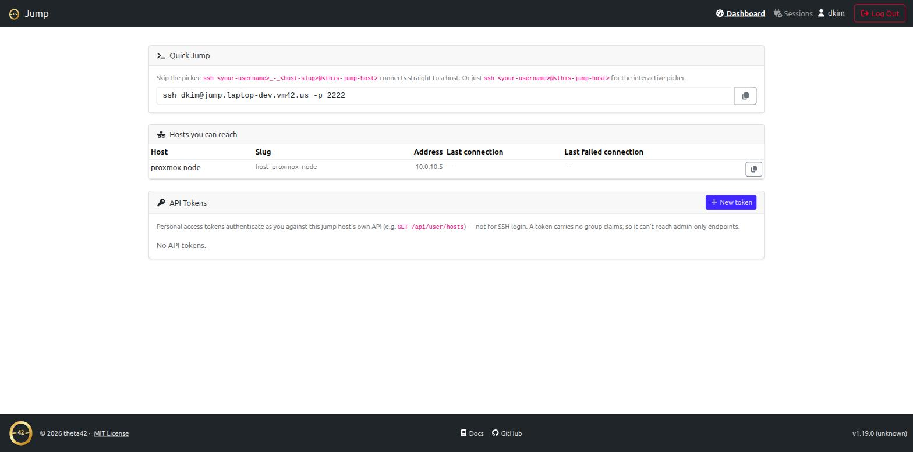
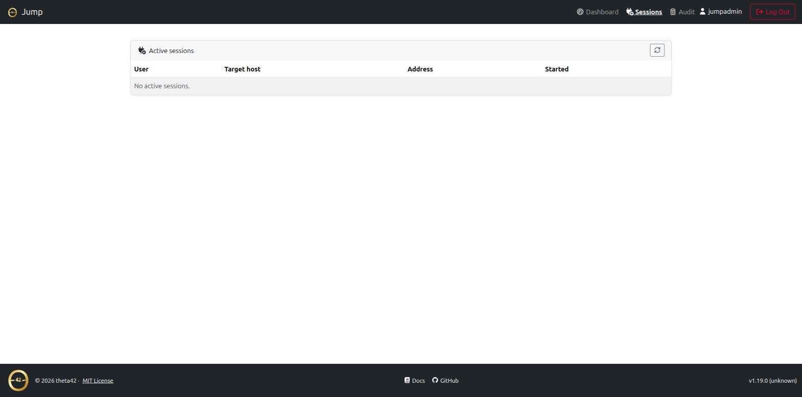
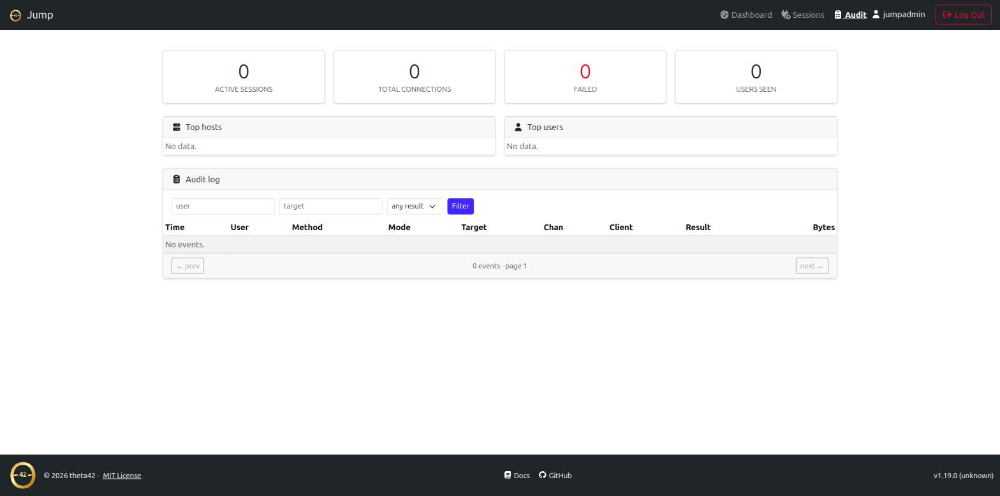

# Theta Gateway

The SSH jump host component of [theta-suite](../). Users SSH into **one**
public host and land on any downstream host they're entitled to —
authenticated against the shared LDAP directory, authorized from
[Theta Directory](../sso/)'s inventory graph, and audited end to end.

No per-host accounts, no distributing keys, no VPN. The same people who log in
to Theta Directory are the people who can reach your machines — and only the
machines their directory groups grant.

Theta Gateway is deployed as part of theta-suite, alongside
[Theta Directory](../sso/) and [Theta Proxy](../proxy/) — it isn't installed
or run on its own. See the [Quickstart](../quickstart.html) to stand up the
whole stack with one command.

## Screenshots

<a href="images/login.png" target="_blank"></a>
<a href="images/dashboard.png" target="_blank"></a>
<a href="images/sessions.png" target="_blank"></a>
<a href="images/audit.png" target="_blank"></a>

*(click any screenshot to view full size)*

## Two ways to connect

**Direct (WinSCP/SFTP-friendly):**

```bash
ssh alice_-_web01@jump.example.com
sftp -P 2222 alice_-_web01@jump.example.com
```

The username grammar is `{uid}_-_{target}` — `target` is a directory host slug
(with or without the `host_` prefix), a bare hostname, or an IP. One username
string, no interactive step, so it works cleanly in WinSCP and scripts.

**Interactive picker:**

```bash
ssh alice@jump.example.com
```

A plain login shows a TUI list of the hosts you can reach; arrow-key or type to
filter, Enter to connect.

See **[Connecting](connecting.html)** for the full usage guide.

## Why a jump host (and why this one)

A bastion/jump host is the standard way to give SSH access to internal machines
through a single audited entry point. What's usually painful is *authorization*
and *credentials*: who may reach which host, and how the bastion authenticates
onward without you copying keys everywhere.

Theta Gateway answers both from your directory:

- **Authorization is your directory graph.** The hosts you can reach are the
  union of your LDAP groups × Theta Directory's inventory (the
  `host_<name>_access` groups the directory already auto-creates). Add
  someone to a group; they can reach the host. No bastion-side allow-list to
  maintain.
- **Onward auth is automatic.** Theta Gateway holds one key and injects its
  public half into your `sshPublicKey` on first use, then connects downstream
  **as you**. Downstream hosts already serve keys from LDAP (via
  ldap-client's `AuthorizedKeysCommand`), so nothing downstream needs
  configuring.

## Features

- **Username-grammar routing** (`uid_-_target`) — straight-through to the host,
  SFTP included (WinSCP works)
- **Interactive TUI host picker** on plain login, scoped to your access
- **LDAP inbound auth** — public key or password (keys-only policy recommended
  for a public host)
- **Directory-driven access** — reachable hosts come from the Theta Directory
  inventory, not a static list
- **Per-user key injection** — no downstream changes, no key distribution
- **Shell, exec, and SFTP** bridging
- **WireGuard mesh routing** — cross-site network access alongside SSH
- **Web UI + HTTP API** for auditing and metrics — active sessions, a searchable
  audit log, per-user/per-host counters
- **Full audit trail** — who, target, method, result, bytes, duration, and the
  downstream host-key fingerprint
