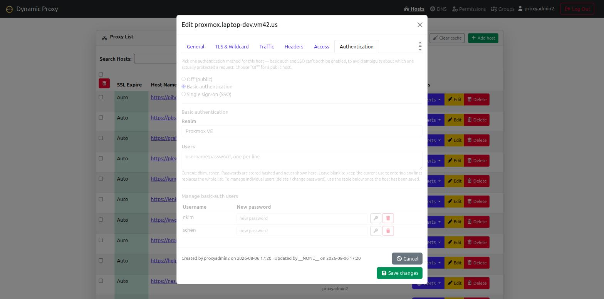
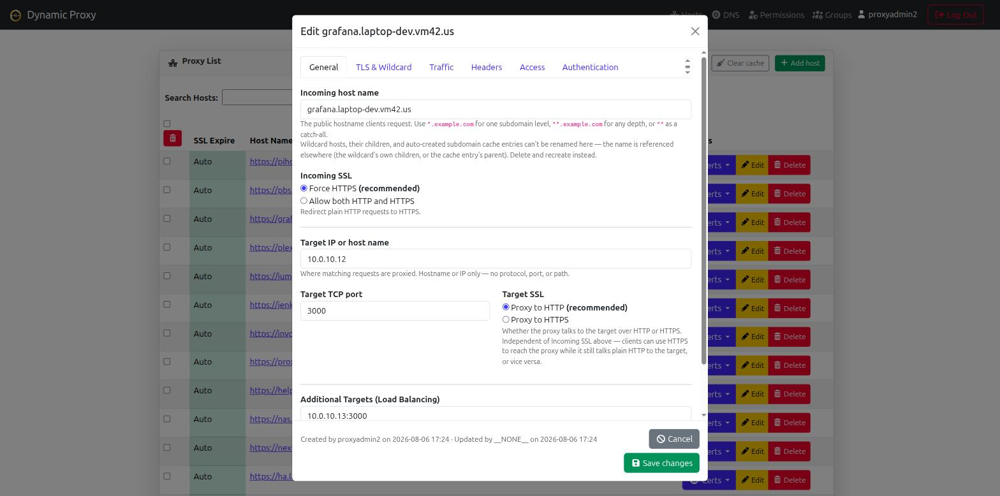

# Theta Proxy

The reverse proxy and HTTPS termination component of [theta-suite](../), built
on OpenResty/nginx. It puts any of your apps behind single sign-on (OIDC) and
can also look users up directly in LDAP — so the same people who log in to
[Theta Directory](../sso/) are the people allowed to reach your proxied apps.

Automatic HTTPS from Let's Encrypt (including wildcards), routing by hostname,
and per-host access control tied to your identity provider — managed from a
web UI or a REST API, with no downtime on config changes.

Theta Proxy is deployed as part of theta-suite, alongside
[Theta Directory](../sso/) and [Theta Gateway](../jump-host/) — it isn't
installed or run on its own. See the [Quickstart](../quickstart.html) to stand
up the whole stack with one command.

## Screenshots

Basic auth and SSO are mutually exclusive per host, with per-user password
management once basic auth is enabled:

Multiple backend targets per host, load balanced round-robin:

*(click any screenshot to view full size)*

## Features

- Automated HTTPS via Let's Encrypt — HTTP-01 and DNS-01 (wildcard) challenges
- Multiple DNS providers (Cloudflare, DigitalOcean, PorkBun, DuckDNS — free)
- Dynamic host routing with wildcard domain matching (`*`, `**`)
- **Multi-target load balancing** — configure multiple backend targets per host with built-in round-robin load balancing
- **OIDC login** and **direct LDAP lookups**, independently of each other, against [Theta Directory](../sso/)
- Per-host **basic auth** as an alternative to SSO (mutually exclusive, so
  it's never ambiguous which one gated a request)
- **Role-based access control** — global admins, local groups, and
  per-domain permissions (viewer/manager)
- Self-service API tokens for scripting/CI without a browser session
- Web UI and a full REST API
