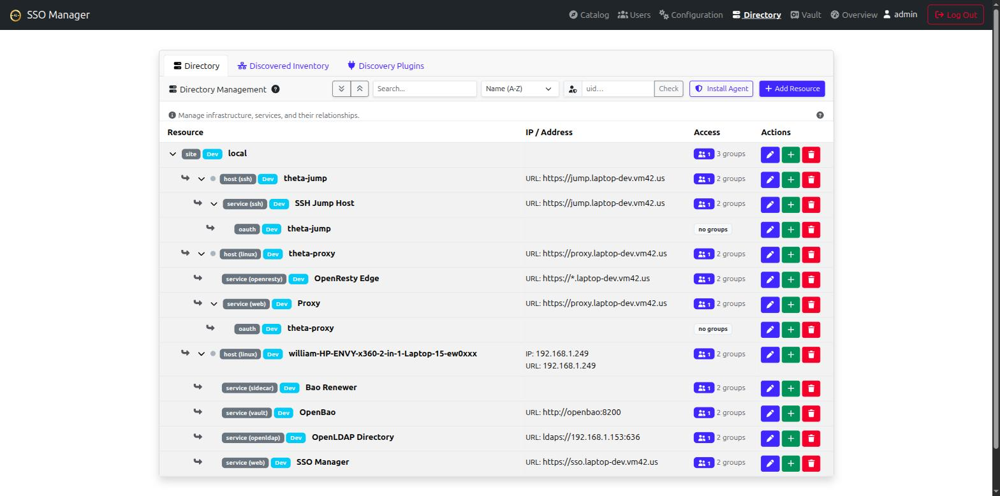

# Directory Management

Theta Directory ships with a built-in **Directory & Inventory Management** feature. Instead of just managing bare LDAP groups for your homelab, the Directory allows you to map out your infrastructure graph and assign rich metadata to your services.

## Architecture

The Directory models your homelab infrastructure using a parent-child graph (e.g. `Site -> Host -> Service`).

There are three primary **Kinds** of resources you can define:
- **Site**: A physical location, datacenter, or root node (e.g., `us-east`). Sites do not require parents.
- **Host**: A physical machine, Proxmox node, virtual machine, or LXC container. A Host **must** have a parent Site or another Host.
- **Service (App)**: An application, web service. A Service **must** have a parent Host or another Service.
- **OAuth Integration**: An OAuth 2.0 / OpenID Connect client application. An OAuth integration **must** have a parent Service.

By defining this hierarchy, Theta Directory builds a queryable graph of your infrastructure.

## Automatic LDAP Group Creation

When you create a new **Host** or **Service** in the Directory via the web UI (or API), Theta Directory will automatically provision two LDAP groups in your directory to govern access to that resource:

1. `<slug>_access` (Member level access)
2. `<slug>_admin` (Owner level access)

For example, if you create a Service named "Emby" with the slug `app_emby`, the system will create the LDAP groups `app_emby_access` and `app_emby_admin`. You can then assign users to these groups, and they will immediately see the service populate on their "My Services" dashboard.

## Resource Metadata

Resources carry a flexible `metadata` JSON object that can store essential context for your applications. The UI natively supports the following metadata fields:

### Common Metadata
- **Sub Type**: Free-form text to categorize the resource (e.g., `proxmox_node`, `linux`, `lxc`, `web`).
- **IP Address**: The internal IP address of the resource.
- **MAC Address**: The hardware address of the primary interface.
- **Host / URI Address**: The FQDN or URL of the resource (e.g., `https://emby.home.arpa`).
- **Production Environment**: A boolean toggle indicating if the resource is in production.

### Host Metadata
- **VMID**: The hypervisor VM or Container ID (e.g. `101`).
- **OS**: The operating system name (e.g. `Ubuntu 22.04.3 LTS`).
- **Kernel**: The kernel version string (e.g. `5.15.0-100-generic`).

### Service Metadata
- **Internal Port**: The local port the service binds to (e.g. `8080`).
- **External Port**: The reverse-proxy or external port (defaults to Internal Port if left blank).
- **Public (No Auth)**: Indicates if the service is exposed publicly without authentication.
- **External Reachable**: Indicates if the service is accessible outside the VPN/local network.
- **Git Repo**: The source code repository for the service (e.g. `https://github.com/...`).
- **Install Path**: The filesystem path where the service is installed (e.g. `/opt/app`).
- **Systemd Service**: The systemd unit name for the service (e.g. `app.service`).

### Who sees which metadata

Metadata keys are declared in `@simpleworkjs/directory-schema` with an `admin` flag, and every API response is passed through its projection. There are three tiers:

- **Public** — returned to any authenticated caller, including machine (`ServiceToken`) callers: `ip`, `address`, `sshPort`, `fqdn`, `dnsNames`, `port`, `externalPort`, `portMappings`, `isExternalReachable`, `os`, `gitRepo`, `subType`, `icon`, `tagline`, `isPublic`, `isProduction`, `requestable`, `isCurrentSite`.
- **Admin-only** — only for members of `app_sso_directory_admin` / `app_sso_admin`: `vmid`, `macAddress`, `installPath`, `systemdService`, and the OAuth config keys (`redirect_uris`, `scopes`, `allowed_groups`, `token_lifetime`).
- **Never returned** — `client_secret_hash`, plus any key matching `/secret|password|privatekey/i`. Stripped on every path, admins included.

Note that machine tokens are deliberately *not* admins, so anything a machine consumer needs (the firewall generator reads `port` / `externalPort` / `isExternalReachable`) has to be in the public tier. A metadata key that isn't declared at all is treated as admin-only and will silently vanish for normal users — if you add a field to the admin form, declare it in the schema package too.

## Catalog & access requests

The site root (`/`) is the end-user catalog — the only ungated page in the nav. It shows:

- **My Access** — everything the signed-in user can reach (`GET /api/discovery/me`), each card carrying a **how to reach it** block: the URL for a service, or the SSH invocation for a host. When `directory.jumpHost` is set in the config, host cards render the jump-host form `ssh <uid>_-_<slug>@<jumpHost>`; otherwise they fall back to a direct `ssh <uid>@<ip>`.
- **Discover More** — everything else in the directory, with a **Request access** button.
- **My Requests** / **Awaiting My Approval** — pending requests, and the approve/deny queue for anyone who owns a requested resource.

A request is a proposal to join an LDAP group. It targets the resource's `member`-level group (the `_access` one, never `_admin`), and approving it performs the LDAP group add — so LDAP stays the single access-control truth and the table is just the audit trail. Approvals are idempotent: approving for someone already in the group succeeds rather than erroring.

Requests are decided by the resource's `owner`, or by any directory admin. Mark a resource `metadata.requestable = false` to keep it out of self-service.

## Navigating the UI

The Directory Management interface provides a **Tree View** toggle that visually nests your resources, making it easy to comprehend your network topography at a glance. You can also filter, search, and sort your entire infrastructure inventory. From the tree view, you can click the green `+` icon next to any resource to instantly add a child resource beneath it.

## Slug conventions

Slugs are the stable identifiers automation keys off, so the tooling around Theta Directory follows a shared convention:

- **Sites**: `site_<name>` — e.g. `site_local`, `site_us-east`
- **Hosts**: `host_<hostname>` — e.g. `host_pve1`, `host_web01`
- **Services/apps**: a plain slug or `app_<name>` — e.g. `sso-manager`, `app_emby`

The auto-created LDAP groups derive from the slug (`<slug>_access` / `<slug>_admin`), so keep slugs stable once access groups are in use.

## Automatic registration

You don't have to build the graph by hand — the theta42 tooling registers itself:

### The stack itself (theta-env)

[theta-env](https://github.com/theta42/theta-env)'s `./setup.sh` seeds the directory on every run with the stack it deploys:

- a **site** (name from `CFG_SITE_NAME` in `setup.env`, default `local` → slug `site_local`) marked as the current site
- the **host** the stack runs on (`host_<hostname>`), with IP, MAC address, OS, and kernel collected from the machine
- the **services** it composes — Theta Directory, Proxy (management UI), OpenLDAP Directory (the LDAPS endpoint Linux hosts and LDAP-native apps bind to), and OpenResty Edge (the 80/443 data plane) — each with its address, internal port, and git repo
- the proxy's auto-registered **OAuth client**, linked under its service

The seed is idempotent and non-destructive: a resource whose slug already exists is considered operator-owned — the seed only fills in metadata fields you haven't set, and never overwrites your values.

### Linux hosts (ldap-client)

The `ldap-client` join script enrolls a Debian/Ubuntu machine for LDAP login (SSSD/PAM), LDAP-backed `sudo`, and SSH keys from the directory — and, when given an SSO API token, registers the machine as a `host_<hostname>` resource with its IP, MAC, OS, and kernel, parented to the site named by its configured location.

## Consumers of the directory

The inventory graph isn't just documentation — other components read it to make decisions:

- **[Jump Host](https://theta42.github.io/jump-host/)** — an SSH jump host that resolves which downstream machines a user may reach from their LDAP groups × the directory's `host` resources (`GET /api/discovery/resources?group=<cn>`), then bridges them in. The `host_<hostname>` slugs and `host_<slug>_access` groups this directory creates are exactly what it keys off; a host's `metadata.ip` / `metadata.sshPort` tell it where to connect. So a machine registered here (by theta-env or ldap-client) becomes reachable through the jump host the moment a user is in its access group.

Planned consumers (end-user catalog, firewall/DNS generation) and the model/API gaps they need are tracked in [`directory_spec.md`](https://github.com/theta42/sso-manager-node/blob/master/directory_spec.md) §9.

## API

All of the above uses the same admin API the UI does (group `app_sso_directory_admin` or `app_sso_admin`):

- `GET/POST /api/directory-admin/resources`, `PUT/DELETE /api/directory-admin/resources/:id`
- `GET/POST/DELETE /api/directory-admin/edges` — parent/child links (`hosts`, `oauth` relations)
- `GET/POST/DELETE /api/directory-admin/groups` — resource ↔ LDAP group links
- `GET /api/directory-admin/access-summary` — per-resource group + member counts (the Access column)
- `GET /api/directory-admin/user-access/:uid` — the reverse lookup: every resource a given user can reach, and via which group
- Read-only graph views (any authenticated user): `GET /api/discovery/resources`, `/api/discovery/resources/:slug`, `/api/discovery/graph`, `/api/discovery/me`

Access requests are open to any authenticated user; deciding is gated per-resource inside the router (resource owner or directory admin):

- `POST /api/access-requests` — `{slug | resourceId, groupCn?, note?}`
- `GET /api/access-requests/mine` — the caller's own history
- `GET /api/access-requests` — pending requests the caller may decide
- `POST /api/access-requests/:id/approve` · `POST /api/access-requests/:id/deny`
- `DELETE /api/access-requests/:id` — the requester withdraws their own pending request
