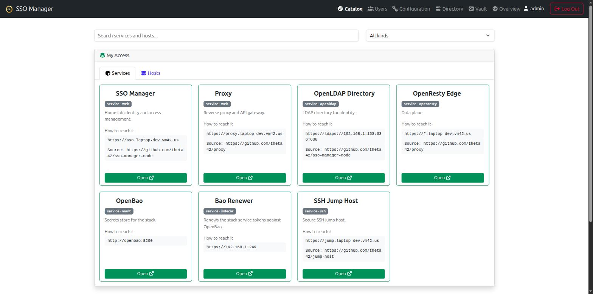
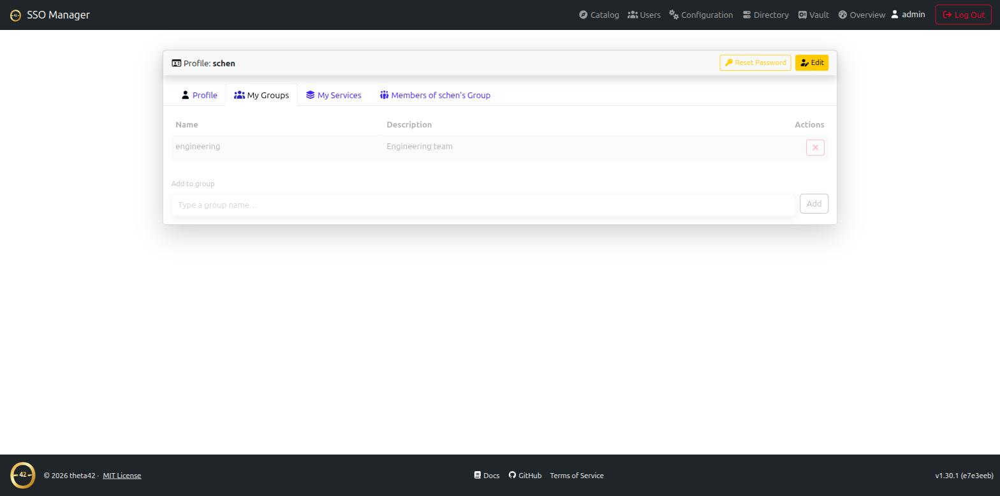
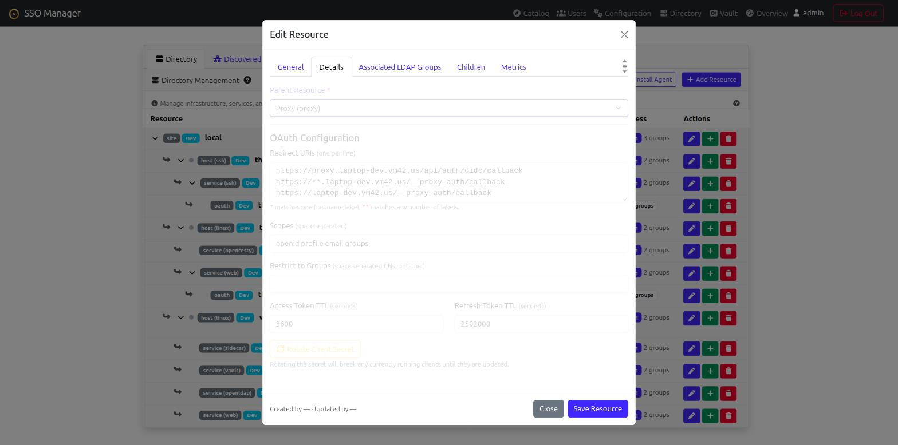
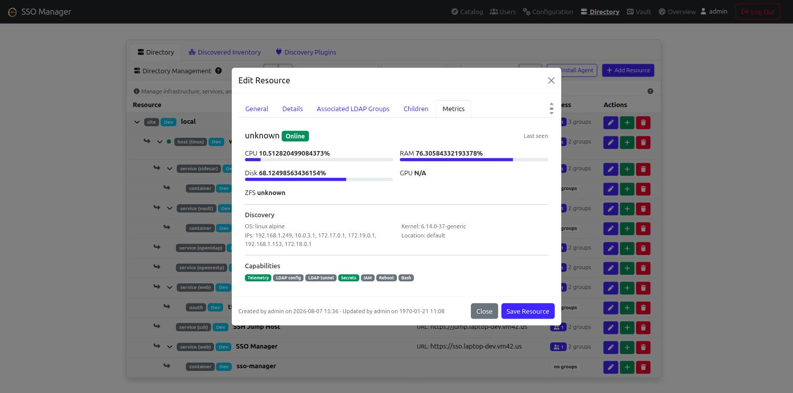

# Theta Directory

The identity and directory component of [theta-suite](../): an **OpenID
Connect provider**, a bundled **OpenLDAP directory**, and a **resource
inventory & IAM engine**, all behind one web console.

One place to manage your users and groups, one login (OIDC) your modern apps
can use, and one LDAP directory your older or odder apps can bind to directly
— plus a graph of every site, host, and service you run, with auto-provisioned
access groups. Everything runs on your own hardware; no phone-home, no hosted
control plane, no per-user pricing.

Theta Directory is deployed as part of theta-suite, alongside
[Proxy](../proxy/) and [Jump Host](../jump-host/) — it isn't installed or run
on its own. See the [Quickstart](../quickstart.html) to stand up the whole
stack with one command.

## Screenshots

*(click any screenshot to view full size)*

## Features

- **OpenID Connect / OAuth 2.0 provider** — your own access/refresh/ID
  tokens; standard discovery document at `/.well-known/openid-configuration`.
- **Bundled OpenLDAP directory** — users, groups, POSIX accounts, SSH public
  keys, and sudo roles, with `memberOf` + referential-integrity overlays.
- **Web management UI** — users, groups, and OAuth clients from a browser;
  invite and password-reset flows over email; self-service profile + API
  tokens.
- **Direct LDAP binds** — anything that binds LDAP directly (Linux hosts
  via PAM/SSSD, Gitea, Emby, …) uses LDAPS/StartTLS against the same
  directory.
- **[Multi-Site](multi-site.html)** — one master site, any number of read-only spokes that join with a single key and stay live-synced, with god_admin-gated promotion if the master goes down for good.
- **Geo-Location Scaling** — built-in support for N-Way Multi-Master OpenLDAP [replication](replication.html) across physical sites (a different, lower-level mechanism — see [Multi-Site](multi-site.html) for how the two compare).
- **[Directory & Inventory](directory.html)** — map sites, hosts, and services as a graph with rich metadata (IP/MAC, OS/kernel, ports, git repos), auto-provisioned access groups, and automatic registration from theta-suite's agents and discovery plugins. Drives directory-aware tools like the [SSH jump host](../jump-host/).
- **Subtype metrics & lifecycle drivers** — telemetry, log streaming, and remote control for resources tagged with a `subType` (`systemd`, `docker`, `proxmox`, `wireguard`, `postgresql`, `redis`, `k8s`, …).
- **OpenBao-backed secrets** — per-resource and per-user secrets with explicit upward inheritance (`Resource → Host → Cluster → Site`).
